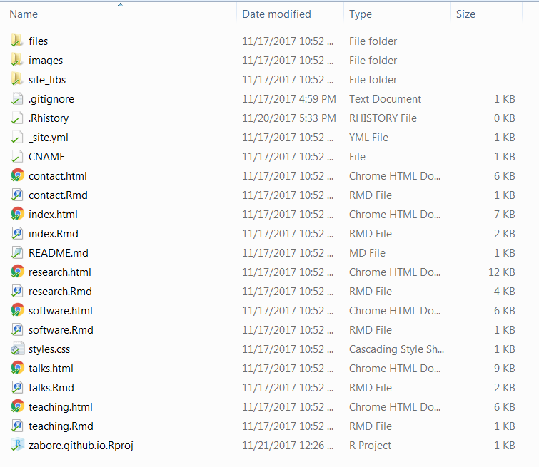
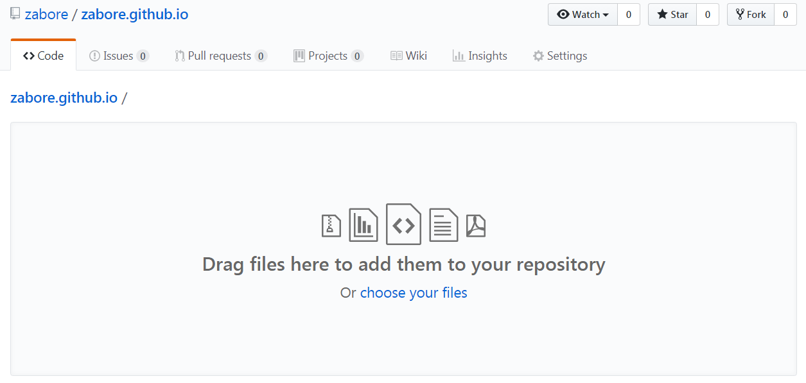
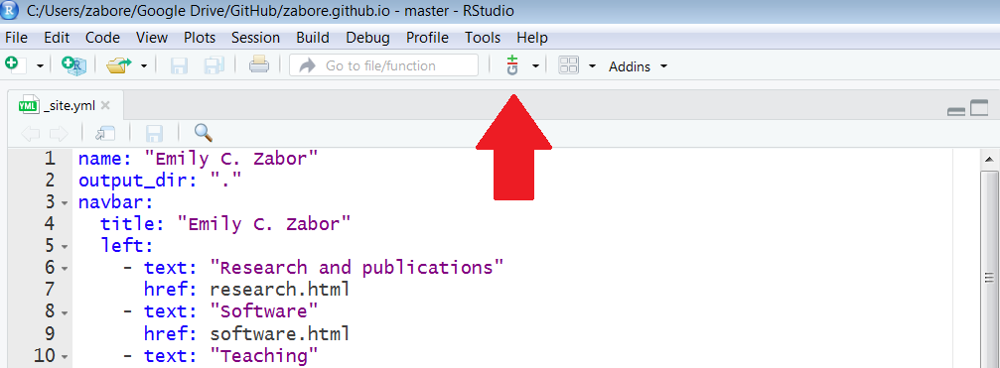
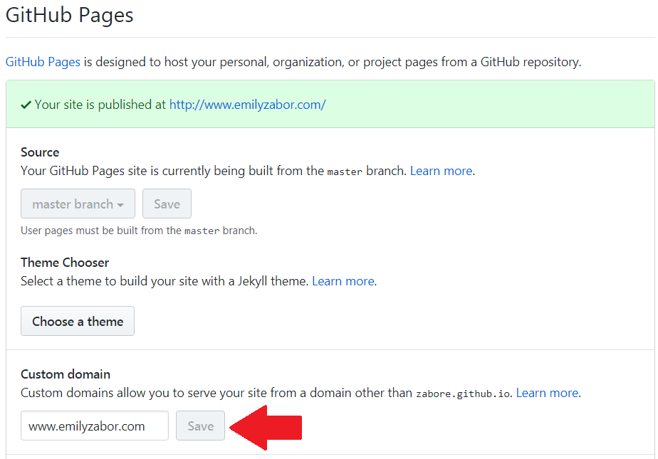
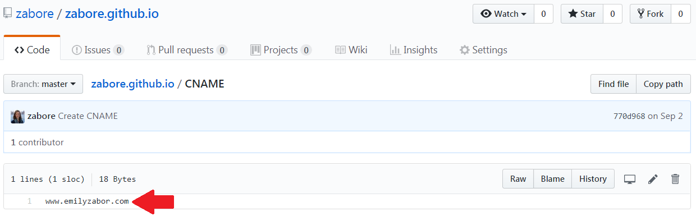
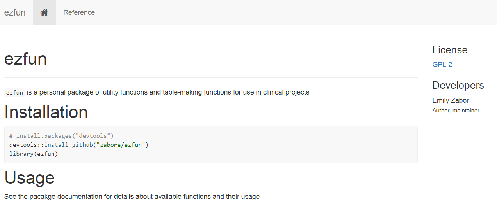
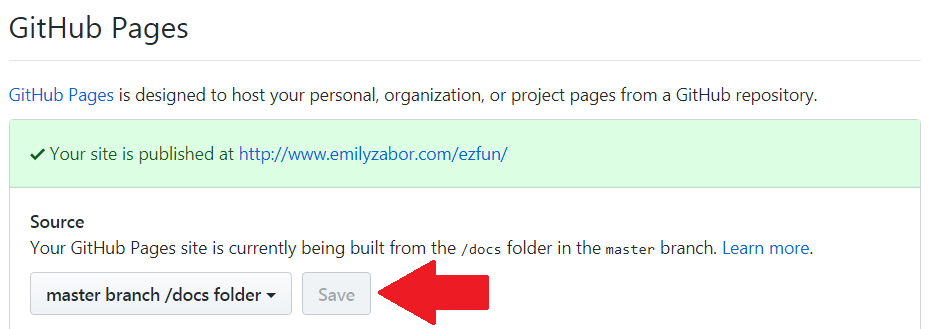
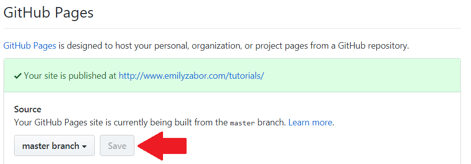
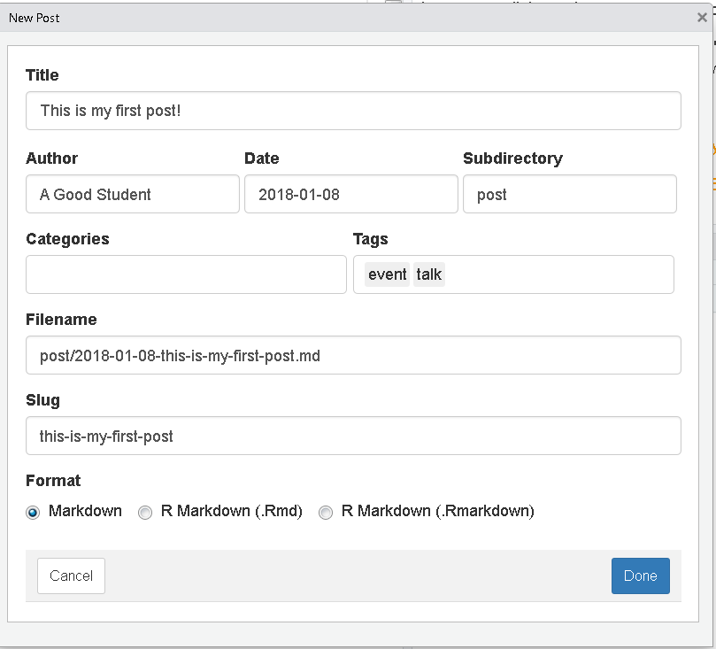
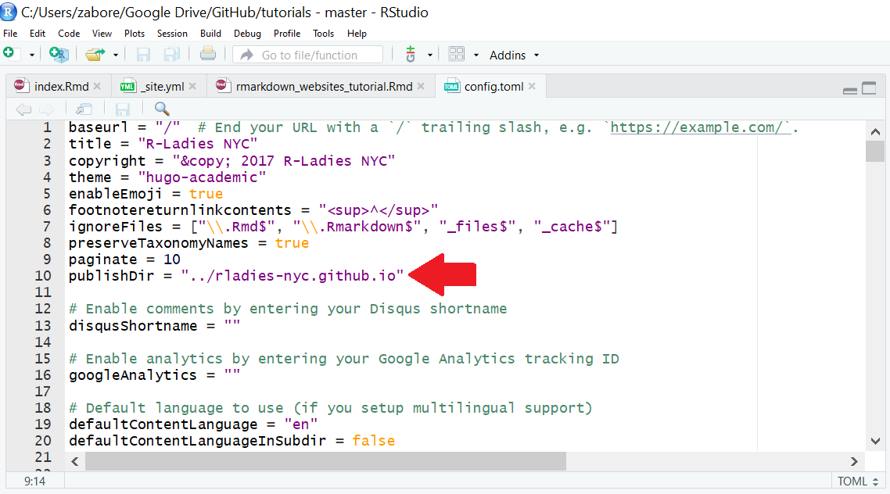

```{r setup, include=FALSE}
knitr::opts_chunk$set(echo = FALSE)
```


Deze tutorial is van Emily C. Zabor die ik heb bewerkt, vooral ook om te zien of ik mijn eigen website kan maken. Deze tutorial laat je zien hoe je een website maakt met gebruik van R, RMarkdown en GitHub. 

Deze tutorial presenteerde zij voor het eerst op R Gebruikers Groep Bijeenkomst op 23 Januari 2018 op het Memorial Sloan Kettering Cancer Center Department van Epidemiologie and Biostatistiek.

Deze versie ververste en presenteerde zij op de R Dames NYC Bijeenkomst op 15 Februarie 2018.


## Typen websites

De belangrijkste typen websites die je zou willen maken zijn:

1. Persoonlijke websites
2. Websites om een pakket te presenteren
3. Project websites
4. Blogs


## De basis van R Markdown website

Wat jij minimaal nodig hebt voor een R Markdown website zijn:

- `index.Rmd`: bevat de inhoud van de homepage van de website 
- `_site.yml`: bevat de metadata voor de website

Een basis voorbeeld voor een `_site.yml` voor een website met twee pagina's kan er zo uitzien:

```{r eval = FALSE}
name: "mijn-website"
navbar:
  title: "Mijn Website"
  left:
    - text: "Basis"
      href: index.html
    - text: "Over"
      href: about.html
```

And a basic `index.Rmd` to create the Home page:

```{r eval = FALSE}
---
title: "Mijn Website"
---
    
Hallo, Website! Welkom in de wereld.
```


Hier vind je een overzicht van de basis van R Markdown website [hier](http://rmarkdown.rstudio.com/rmarkdown_websites.html).


## GitHub

Deze tutorial left de nadruk op het hosten van websites via GitHub. Hosten van websites via GitHub is gratis.

Als je nog geen GitHub account hebt, teken dan op via [https://github.com/join?source=header-home](https://github.com/join?source=header-home) met username YOUR_GH_NAME. Ik zal naar deze username, YOUR_GH_NAME, als  "jouw GitHub username" refereren in deze hele tutorial.

Er zijn andere mogelijkheden om jouw website gratis te hosten. Een ander populaire keuze is [Netlify](https://www.netlify.com/).


## Persoonlijke websites

Een voorbeeld van een homepage van  [Emily Zobore's website](http://www.emilyzabor.com/) is:


Er zijn twee belangrijke stappen om een persoonlijke website te maken die op GitHub wordt gehost:

1. GitHub setup
2. Lokale setup


### GitHub setup

1. Creëer een GitHub repository ("repo") genaamd YOUR_GH_NAME.github.io, waar YOUR_GH_NAME jouw GitHub username is.
2. Initialiseer het met een README 
    - Voor hen die met GitHub weinig ervaring hebben: dit kan het proces van klonen van repository en daarmee het afstemmen met de 'master branch' vergemakkelijken.


### Lokale setup

1. Kloon deze remote repository op een locale directory met dezelfde naam, YOUR_GH_NAME.github.io
2. Voeg een R Project toe aan deze directory
3. Maak een `_site.yml` en een `index.Rmd` file in jouw nieuwe directory


### Waarom heb ik een R Project nodig?

Het R Project is gemakkelijk omdat RStudio jouw project als een website zal herkennen en zorgt voor de goede gereedschappen die je nodig hebt. 

Opgelet: Nadat je een R Project met de goede files hebt gemaakt, kan het zijn dat je het project moet sluiten en heropenen voordat R het herkent als een  website en de goede gereedschappen toont.


### Creëer inhoud

Pas de `_site.yml` file aan door de metadata te veranderen en het thema van jouw website. Kijk maar eens naar de Jekyll thema's [hier](http://jekyllthemes.org/) en speel wat met de verschillende opties. Thema's zijn makkelijk te veranderen, zelfs nadat je de inhoud hebt toegevoegd. 

Bijvoorbeeld de `_site.yml` voor de persoonlijke website van Emily ziet er zo uit:

```{r eval = FALSE}
name: "Emily C. Zabor"
output_dir: "."
navbar:
  title: "Emily C. Zabor"
  left:
    - text: "Writing"
      href: research.html
    - text: "Speaking"
      href: talks.html
    - text: "Programming"
      href: software.html
    - text: "Teaching"
      href: teaching.html
  right:
    - icon: fa-envelope fa-lg
      href: contact.html
    - icon: fa-github fa-lg
      href: http://github.com/zabore
    - icon: fa-twitter fa-lg
      href: https://twitter.com/zabormetrics
    - icon: fa-linkedin fa-lg
      href: https://www.linkedin.com/in/emily-zabor-59b902b7/
output:
  html_document:
    theme: paper
    css: 'styles.css'
```

Pas aan en creëer `.Rmd` files met de inhoud van jouw website, die er html-pagina's voor jouw website van maken als jij ze 'knit'. 

De `index.Rmd` file voor de homepage van Emily's persoonlijke website ziet er zo uit:

```{r eval = FALSE}
---
---

<link rel="stylesheet" href="styles.css" type="text/css">


I like to analyze data to answer research questions and test hypotheses. Currently I investigate questions related to breast cancer through my work as a Research Biostatistician at [Memorial Sloan Kettering Cancer Center](https://www.mskcc.org/departments/epidemiology-biostatistics) in the department of Epidemiology & Biostatistics. 

I graduated from the [University of Minnesota](http://www.sph.umn.edu/academics/divisions/biostatistics/) with a MS in biostatistics in 2010. In 2012 I began working toward my DrPH in biostatistics as a part-time student at [Columbia University](https://www.mailman.columbia.edu/become-student/departments/biostatistics), where I am investigating statistical methods for the study of etiologic heterogeneity in epidemiologic studies under the advisement of [Dr. Shuang Wang](https://www.mailman.columbia.edu/people/our-faculty/sw2206) at Columbia University and [Dr. Colin Begg](https://www.mskcc.org/profile/colin-begg) at Memorial Sloan Kettering Cancer Center. I expect to graduate by the end of 2018.

I am a well-known R enthusiast, including serving on the board and being an active member of [R Ladies NYC](http://www.rladiesnyc.org/). 

My full CV is available [here](files/Zabor_CV_2017_Q4.pdf).
```

Als je een keer de inhoud hebt geschreven en de lay-out hebt opgezet, zoek dan de Build tab in RStudio op en selecteer "Build Website":


Nu heeft jouw local directory alle files die nodig zijn om jouw website te maken:




### De website uitzetten

Basis benadering:

- Selecteer "Upload files" van de hoofpagina pagina van jouw GitHub repository:


- En sleep eenvoudig of selecteer de files van jouw locale repository:




Geavanceerde benadering (aangeraden):

- gebruik Git als cliënt of van binnenuit RStudio (een andere goede reden om een R Project! te gebruiken)



- Maar dit is geen Git/GitHub tutorial. Als je meer wilt leren over Git/GitHub, ik raad jou aan dit te doen, dan is dit een goede bron om mee te beginnen: [http://happygitwithr.com/](http://happygitwithr.com/)


### Aangepaste domeinen

Het standaardadres om jouw wite te hosten is http://YOUR_GH_NAME.github.io, maar je kunt jouw domeinnaam ook aanpassen. Dan zijn er twee stappen te zetten:

1. In jouw GitHub repository YOUR_GH_NAME.github.io, ga je naar Settings > GitHub pages. Typ jouw domeinnaam in de box onder Custom domain en sla het op (Save).



2. Voeg een CNAME file toe aan jouw GitHub repository YOUR_GH_NAME.github.io. 

Het zal als volgt in jouw repository verschijnen:


And inside the file you will simply have your domain name:




## Pakket websites

Een voorbeeld hiervan is deze [website](http://www.emilyzabor.com/ezfun/) van Emily's R-pakket `ezfun`:



Gebruik Hadley Wickham's goede pakket `pkgdown` om makkelijk een website van jouw pakket te maken die op GitHub wordt gehost. Details over `pkgdown` kun je hier vinden [de pkgdown website](http://pkgdown.r-lib.org/), die ook met inzet van `pkgdown` is gemaakt.

Dit veronderstelt wel dat je al een R-pakket met een locale directory hebt en een GitHub repository.

From within your package directory run: 

```{r eval = FALSE}
devtools::install_github("hadley/pkgdown")
pkgdown::build_site()
```

- Dit zal een folder toevoegen met de naam `docs` binnen de locale directory voor jouw pakket 

- Upload/push deze veranderingen in de GitHub repository voor jouw pakket

- In the GitHub repository voor jouw pakket ga je naar Settings > GitHub pages. Selecteer "master branch/docs folder" als de bron en sla op (Save)



- De persoonlijke pagina zal worden toegevoegd aan jouw persoonlijke website en aan YOUR_GH_NAME.github.io/repo_name

- De homepage kun je via README file op jouw repository binnenhalen

- De referentiepagina van de site omvat alle functies met hun beschrijving

- Elke functie klikt door naar de hulppagina ervan, 

- En in bepaalde gevallen ook naar vignettes met goede informatie

En dan ben je klaar, zo makkelijk als dat.


## Project websites

Ook als je geen pakket maakt kun je nog wel een repository maken. Emily Zabore heeft bijvoorbeeld [een pagina](http://www.emilyzabor.com/tutorials/) op haar website die linkt naar de repository waarin deze tutorial is opgeslagen.


### Lokale setup

Vanuit de lokale directory van het project waar het jou om te doen is:

1. Creëer een `_site.yml` en `index.Rmd` file in jouw nieuwe directory
2. Pas deze files met jouw inhoud en layout, net zoals bij persoonlijke websites


### GitHub setup

- Upload/push deze nieuwe files in de  GitHub repository voor jouw project

- Ga naar GitHub pagina's voor de repository en ga naar Settings > GitHub Pages, waar je de "master branch" folder selecteert en je drukt op Save




## Blogs

R Markdown websites zijn makkelijk te maken en uit te zetten, maar het wordt lastiger als je het voortdurend moet verversen of veranderingen moet aanbrengen, zoals dat het geval is bij een blog. Gelukkig, het R-pakket `blogdown` bestaat juist voor dit doel. `blogdown` is een R pakket dat jou in staat stelt statistische websites te makenthat allows you to create static websites, wat betekent dat de uitgezette versie van de website alleen bestaat uit JavaScript, HTML, CSS en plaatjes. Gelukkig is het `blogdown` pakket zo opgezet dat je over al die zaken niets af hoeft te weten om toch nog een mooie website te maken voor jouw blog, met de ondersteuning van Hugo.

Voor de beste referentie van `blogdown` website, kijk naar [dun blogdown boekje](https://bookdown.org/yihui/blogdown/).

Emily Zabore heeft geen persoonlijk blog, maar wel een website/blog gebouwd rond deze bijeenkomsten in New York [R-Ladies NYC](http://www.rladiesnyc.org/) en dat is hier als voorbeeld toegevoegd.


### Setup

De eerste drie stappen zijn hetzelfde als het maken van een basis R Markdown website:

1. Creëer een GitHub repository met de naam YOUR_GH_NAME.github.io, waar YOUR_GH_NAME jouw GitHub gebruikersnaam is, geïnistialiseerd met een README file
2. Kloon deze GitHub repo op een lokale directory met dezelfde naam
3. Voeg een R Project aan jouw lokale directory toe

Dan beginnen we met `blogdown`.

4. Installeer `blogdown` en Hugo

```{r eval = FALSE}
install.packages("blogdown")
blogdown::install_hugo()
```

5. Kies een [thema](https://themes.gohugo.io/) en vind de link naar de thema's van de GitHub repository. In dit geval zijn de thema's niet zo makkelijk te wisselen als binnen de basis R Markdown website, dus kies het thema zorgvuldig.

6. Genereer een nieuwe site binnen jouw project sessie. De optie `theme_example = TRUE` zal voor de files van een voorbeeldsite zorgen die je op basis van wat je nodig hebt kunt aanpassen.. "user/repo" refereert naar de GitHub gebruikers naam (user) en de GitHub repository (repo) voor jouw geselecteerde thema.

```{r eval = FALSE}
blogdown::new_site(theme = "user/repo", theme_example = TRUE)
```

Dit zal alles van de filestructuur van jouw nieuwe blog genereren.


Nadat je dit hebt afgerond, moet je sluiten en dan het project weer heropenen. Als je heropent, zal RStudio het project als een website herkennen.


### Het aanpassen van het beeld

Veranderingen voer je in de `config.toml` file door (hetzelfde als de `_site.yml` die we bij de R Markdown websites tegenkwamen); zo verander je de layout en het beeld van jouw website. De beschikbare kenmerken in de `config.toml` zullen verschillend zijn afhankelijk van jouw thema en de meeste themavoorbeelden hebben een eigen `config.toml` die je als template kunt gebruiken.

Als je een keer de kenmerken van jouw website hebt aangepast, klik dan op RStudio's "Serve Site" om de site lokaal al te bekijken.


### Een nieuwe blog post schrijven

Er zijn verschillende manieren om een nieuwe blogpost op jouw site te schrijven, maar het is het makkelijkste om dat via "New Post" in RStudio te doen:


Dit opent een pop-up waar je de meta-data voor a nieuwe post kunt plaatsen:


In aanvulling op Titel, Auteur en Datum van de post, kun je aanvullend ook categorieën creëren, die jouw post in folders organiseren en kun je tags aan de posts toevoegen, waarmee ze te zoeken zijn binnen de inhoud van jouw website.
Wees er wel van bewust dat het functioneren van deze kenmerken varieert per thema. Bepaalde blogs kunnen ook in toekomst worden geplaatst.

Zie onderaan dat je ook kunt kiezen tussen een regulier markdown (`.md`) of R markdown (`.Rmd`) file. `.Rmd` files moeten worden gerenderd voordat ze html pagina's genereren. Dus het is het beste dit te gebruiken waar ook een R code in zit.

Een file naam en een 'slug' worden automatisch genereerd gebaseerd op de andere metadata. De 'slug' is een URL-vriendelijke titel van jouw post.




### Presenteren

Een `blogdown` site is een beetje lastig te bouwen en te presenteren via GitHub vergeleken met een reguliere R Markdown website en vergeleken met wat hierboven is beschreven. 

*Probleem 1*: Omdat het een statistische site betreft, de files genereren automatisch on line in een aparte subdirectory onder de naam `public` binnen jouw lokale directory. Echter, dit veroorzaakt problemen met het hosten (presenteren) van GitHub omdat de files dan in de lokale YOUR_GH_NAME.github.io directory moeten zitten.

De oplossing:

1. Hou aparte directories voor de bron files (deze directory bijvoorbeeld "source", bron noemen) en voor de statische files (de directory YOUR_GH_NAME.github.io) die gegenereerd worden. De "source" folder is waar your R project en `config.toml` files zich bevinden.


2. Gebruik in jouw `config.toml` de optie `publishDir = ` om `blogdown` te publiceren via de YOUR_GH_NAME.github.io folder. Dat is eenvoudiger dan de standaard manier op jouw lokale locatie.



*Probleem 2*: GitHub gebruikt standaard Jekyll met website inhoud en dat moet ongedaan worden gemaakt omdat `blogdown` sites met Hugo worden gebouwd.

Om dit op te lossne moet je een lege file toevoegen met de naam `.nojekyll` in jouw GitHub repo YOUR_GH_NAME.github.io, voordat je het publiseert.


## Het pakket Distill

Mijn eigen blog [Harrie's hoekje](https://bookdown.org/hjonkman/hhwptest/) maak ik met het pakket [Distill](https://rstudio.github.io/distill/blog.html). Om een blog te maken installeer je Distill. Dan maak je een new blog en gebruik je Distill Blog.


Dan worden er een project gemaakt met een aantal documenten:
_site.yml   
index.rmd   
about.rmd   
_posts/welcome/welcome.rmd   

Vervolgens pas je de *_site.yml* aan op basis van hoe jouw blog eruit moet zien.

als je een post wilt creëren open je het programma (`library(distill)`) en je tikt in `create_post("Hier de naam van de post"). Hier [Distill](https://rstudio.github.io/distill/blog.html) vind je veel meer informatie hierover.Hier [Tensorflow)(https://blogs.rstudio.com/tensorflow/) vind je een ander voorbeeld hoe de blog er dan uit kan zien.  

Met Distill kun je op dezelfde eenvoudige manier een website maken [Distill-website](https://rstudio.github.io/distill/website.html). Nadat je het Distill hebt geinstalleerd en geopend (`library(Distll)`). Krijg je de volgende documenten
_site.yml (om de website te configureren)   
index.rmd (voor de homepage)   
about.rmd (waar de website over gaat)   

Verder werkt dit hetzelfde. 

## Aanvullende bronnen

Hieronder vind je de aanvullende bronnen en linken waar in deze tutorial naar wordt verwezen:

- [http://rmarkdown.rstudio.com/rmarkdown_websites.html](http://rmarkdown.rstudio.com/rmarkdown_websites.html): an overview of R Markdown website basics
- [http://jekyllthemes.org/](http://jekyllthemes.org/): Jekyll themes for use with your R Markdown website
- [http://happygitwithr.com/](http://happygitwithr.com/): an introduction to Git/GitHub
- [http://pkgdown.r-lib.org/](http://pkgdown.r-lib.org/): Hadley Wickham's `pkgdown` website
- [https://bookdown.org/yihui/blogdown/](https://bookdown.org/yihui/blogdown/): Yihui Xie's blogdown book
- [https://themes.gohugo.io/](https://themes.gohugo.io/): Hugo themes for use with your `blogdown` website


 


