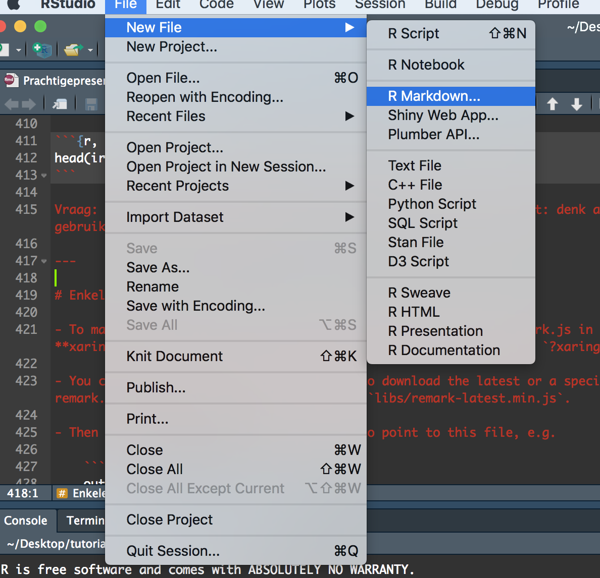

```{r setup, include=FALSE}
knitr::opts_chunk$set(echo = FALSE)
```


## PRACHTIGE HTML-SLIDES MAKEN MET XARINGAN

Om mij dit goed eigen te maken heb ik de post van Fabio Votta (7 augustus 2018) en de presentatie van Yihui Xie vertaald (zie: Prachtigepresentaties.rmd). Het lijkt simpel, maar voor mij is dit een goede manier om het eigen te maken. Nadat ik dit heb gedaan, heb ik er zelf enkele zaken aan toegevoegd die ik handig vind of die nieuw zijn.

## Introductie

Er zijn vele manieren om presentaties te maken met R Markdown. Het pakket `xaringan`, gebouwd door Rstudio medewerker Yihui Xie, is een van de mogelijkheden om attractractief vormgegeven HTML5 slides te maken die echt opvallen. De mooie layout en de beknopte en nette codeerstructuur maakt het aangenaam om mee te werken. Het pakket is gebaseerd op de remark.js bibliotheek en als je er meer over wilt weten kun je dit hier (https://remark.js.org/) doen. Hier zijn enkele voorbeelden van dia's van de maker die ook als introductie dienen:

https://slides.yihui.name/xaringan/

Ben je klaar om een **presentatie ninja** te worden?

## Installatie
Er zijn verschillende manieren om pakketten in R te installeren. Een veilige manier is het om het xaringan pakket van CRAn te installeren, en wel op de volgende manier

`install.packages("xaringan")` 

Soms zijn de versies op CRAN iets ouder. Als je geïnteresseerd bent in de nieuwste versie, is het altijd een optie om te zoeken naar de gerelateerde (GitHub) repository. Om het vanaf hier te installeren, moet je eerst het `devtools`- pakket installeren voor het geval je het niet hebt en vervolgens `install_github("yihui/xaringan")` gebruiken om het pakket vanuit GitHub te installeren.
## installeer alleen devtools indien nodig 
## devtools::installeer_github('yihui/xaringan')

Om een xaringan-presentatie te maken, maak je een RMarkdown document met het xaringan::moon_reader outoutformat. Het is makkelijk om binnen RStudio te beginnen. Klik eert op het New File icoon en dan op RMarkdown zoals hieronder




Selecteer dan vervolgens "From Template" de Ninja Presentation en je zult een RMarkdown voorbeeld zien:


Druk op de Knit-knop en voeg de boel samen.

## Basis

Zoals bij elk R Markdown document, is er een `yaml header` aan het begin die enkele meta data specificeert. Hier kun je de titel van de presentatie, auteurs en meer opgeven. Dit configureert de titeldia. Hier kan nog veel meer gedaan worden om je dia's aan te passen en vast te stellen hoe ze eruit zullen zien, maar voorlopig houden we ons aan de basis. Hier is hoe uw `yaml header` eruit zou kunnen zien:


Dat geeft het volgende resultaat:


Zo worden slides met xaringan gemaakt. Makkelijk!

Over het algemeen gelden de gewone R Markdown-regels, zodat je deze cursief kunt gebruiken en twee sterren voor bijvoorbeeld vetgedrukte of zelfs je meest ingewikkelde LaTeX-vergelijkingen.

- Hoe meer hashtags je toevoegt, hoe kleiner de header.   
- De dia's worden dan gescheiden door drie streepje--- Voor de eerste dia hoeft u dit niet te doen omdat die na de yaml header verschijnt.   
- Als we elementen op de dia's met een klik willen laten verschijnen, scheiden we ze met twee streepje, -- zoals deze.   
- Tenslotte, als we meer ruimte tussen de elementen op een dia willen hebben, kunnen we de html-tag <br> gebruiken.

Je zou met zoiets kunnen beginnen:


``` 
# Slide 1

Dit is slide 1

* Item 1
* Item 2
    + Item 2a
    + Item 2b
  

---

# Slide 2

Dit is slide 2

Hier een moeilijke vergelijking:

$$S (ω)=1.466\, H_s^2 \,  \frac{ω_0^5}{ω^6 }  \, e^[-3^ { ω/(ω_0  )]^2}$$

---

# Slide 3

Dit is slide 3

--

Dit verschijnt met een klik

--

<br>
<br>

Dit verschijnt ook met een klik maar wat later

```


Dit ziet er al goed uit.

## Het opmaken van dia's

Laten we zeggen dat we een beetje met het formaat van onze dia's willen spelen. Er zijn enkele ingebouwde functies waarmee we precies dat kunnen doen. We definiëren de volgende code aan het begin van een dia:
```
---
class: inverse, center, middle
# Statistische Analyse
```


Hierdoor wordt de kleur (hier: zwart) omgekeerd door de elementen horizontaal (midden) en verticaal (midden) op die dia te centreren. Dit zorgt voor een aantal mooie koele overgangsplaten.

Dat geeft de volgende slide:

## Een GIF of een afbeelding toevoegen

U kunt ook GIF's of afbeeldingen aan uw dia's toevoegen. Dit gebeurt op precies dezelfde manier als bij een normaal R Markdown document. Hier is een voorbeeld:


```
---

class: inverse, center, middle


```


## Inzet van thema's en xaringanthemer

We hebben al een lange weg afgelegd om mooie xaringan dia's te maken. Als we het thema van de presentatie wilden aanpassen, dan wordt xaringan geleverd met een aantal ingebouwde kleurenschema's die je kunt uitproberen.
Hier is er een van. Voeg gewoon de volgende regel toe in je YAML header en je bent klaar om te gaan:

```
output:
  xaringan::moon_reader:
    css: [metropolis]
```


Hier is een rijtje thema's:
- metropolis
- hygge
- rladies
Als u uw eigen thema's wilt creëren, kan ik u het `xaringanthemer` pakket aanbevelen:
https://github.com/gadenbuie/xaringanthemer


## De presentatie exporteren naar .pdf
De output van xaringan is html-format. Als u echter een .pdf-bestand wilt, kunt u de dia's gewoon openen in uw favoriete webbrowser en ze afdrukken naar .pdf. Dit lijkt de gemakkelijkste versie om dit te doen.


## Wat nu?
Ik hoop dat je genoten hebt van deze kleine tutorial!    

Hier zijn nog enkele voorbeelden van mooie xaringan dia's die als inspiratiebron kunnen dienen:
https://github.com/favstats/xaringan_slides/   

Wilt u animatieovergangen toevoegen? Nou, hier is een implementatie daarvan:
https://www.garrickadenbuie.com/blog/2018/12/03/animate-xaringan-slide-transitions/   

Tot slot helpt een wiki om meer geavanceerde opties te implementeren. Zorg ervoor dat je het op een gegeven moment bekijkt:
https://github.com/yihui/xaringan/wiki   


