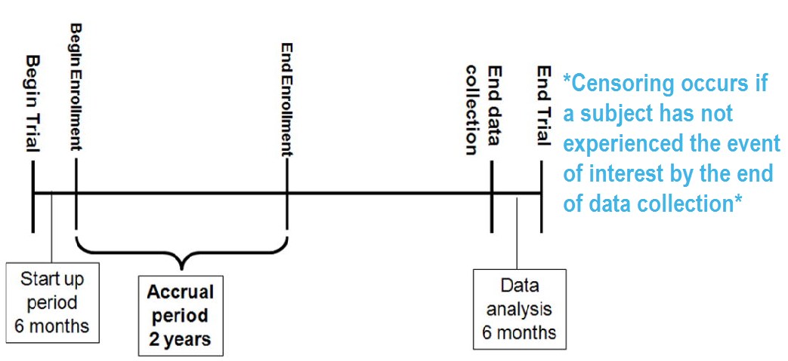

# Voorwoord
Onlangs volgde ik een webinar bij STATA over analyse van survival data (https://www.stata.com/training/webinar_series/survival-analysis/). Vervolgens ben ik op zoek gegaan naar een tutorial in R over survival analyse en kwam terecht by deze interessante tutorial van Emily Zabore. Deze had ik al eens eerder zien staan maar dit was het moment om er eens goed naar te kijken. Om mij de techniek goed eigen te maken heb ik deze voor het grootste deel naar het Nederlands toe omgezet en waar nodig bewerkt. Alle credits gaan naar Emily Zabore die dit zo helder en duidelijk op rij heeft gezet (hartelijke dank, Emily). Deze tutorial is dus een introductie op survival analyse en hoe deze techniek in R uit te voeren. Emily Zabore presenteerde dit voor op R-Presentatie serie van het Memorial Sloan Kettering Cancer Center in New York op 30 augustus 2018. Daarna heeft ze deze aangepast voor een meer intensievere training op hetzelfde centrum in Maart 2019. De informatie kun je vinden op haar Github repository waar je [deze tutorial en de bron-files](https://github.com/zabore/tutorials) kunt vinden. 


```{r setup, include=FALSE}
# laad de volgende pakketten
library(knitr)
library(tidyverse)
library(lubridate)
library(survival)
library(survminer)

# stel de output opties in
opts_chunk$set(fig.width = 5, 
               fig.height = 4
)
```


# Deel 1: Introductie op Survival Analyse

Deze tutorial bevat enige basisinformatie over survival analyse en de volgende uitgaven kunnen jou hierbij verder helpen:

> Clark, T., Bradburn, M., Love, S., & Altman, D. (2003). Survival analysis part I: Basic concepts and first analyses. 232-238. ISSN 0007-0920.

> M J Bradburn, T G Clark, S B Love, & D G Altman. (2003). Survival Analysis Part II: Multivariate data analysis – an introduction to concepts and methods. British Journal of Cancer, 89(3), 431-436.

> Bradburn, M., Clark, T., Love, S., & Altman, D. (2003). Survival analysis Part III: Multivariate data analysis -- choosing a model and assessing its adequacy and fit. 89(4), 605-11.

> Clark, T., Bradburn, M., Love, S., & Altman, D. (2003). Survival analysis part IV: Further concepts and methods in survival analysis. 781-786. ISSN 0007-0920.


## Pakketten

Enkele R-pakketten zullen in ieder geval gebruikt worden:

- `lubridate`
- `survival`
- `survminer`

Zorg ervoor dat ze geïnstalleerd zijn (wel doen, anders werkt het niet) en open ze vervolgens zo: 

```{r}
library(survival)
library(survminer)
library(lubridate)
```


## Wat zijn survival data?

Het gaat om Tijd-tot-gebeurtenis (Time-to-event) data die bestaan uit een aparte starttijd en eindtijd.

Voorbeelden uit kankeronderzoek zijn:

- Tijd van operatie tot dood;   
- Tijd van start van de behandeling tot progressie;   
- Tijd van antwoord op herhaling.   


## Voorbeelden uit andere velden:

Tijd-tot-gebeurtenis data zijn in verschillende velden algemeen, waaronder:

- Tijd van HIV infectie tot ontwikkeling van AIDS;   
- Tijd tot hardaanval;   
- Tijd tot begin van alcoholmisbruik;   
- Tijd tot initiatie van sexuele activiteit;   
- Tijd tot machine niet meer goed functioneert.


## Hoe survival analyse ook wel wordt genoemd

Omdat survival analyse in allerlei velden wordt gebruikt, kent het ook verschillende namen:

- Betrouwbaarheids-analyse;  
- Duur-analyse;   
- Gebeurtenisgeschiedenis-analyse;   
- Tijd-tot-gebeurtenis-analyse.


## De longdataset

De `long` dataset is beschikbaar via het `survival` pakket in `R`. De data bevatten subjecten met gevorderde longkanker van de North Central Cancer Treatment Group. Enkele variabelen (waarvoor ik de Engelse namen gebruik zoals ze in de dataset voorkomen) die we zullen gebruiken om methodes aan te tonen zijn: 

- time:	Overlevingstijd (Survival tijd) in dagen;   
- status:	censoring status 1=censored, 2=dood;   
- sex: Man=1 Vrouw=2.


## Wat is censoring?

```{r trial_anatomy, echo = FALSE}

```

> RICH JT, NEELY JG, PANIELLO RC, VOELKER CCJ, NUSSENBAUM B, WANG EW. A PRACTICAL GUIDE TO UNDERSTANDING KAPLAN-MEIER CURVES. Otolaryngology head and neck surgery: official journal of American Academy of Otolaryngology Head and Neck Surgery. 2010;143(3):331-336. doi:10.1016/j.otohns.2010.05.007.


## Typen van censoring

Een subject kan gecensored zijn vanwege:

- Omdat we ze niet meer te volgen zijn;   
- Ze uit de studie zijn gestapt;   
- Er geen gebeurtenis kon worden vastgesteld bij het einde van de vaststaande studieperiode.

Dit zijn voorbeelden van **rechts** censoring. 

Links censoring en interval censoring zijn ook mogelijk en er zijn methodes om dit soort data te analyseren, maar hier beperken we ons tot rechts censoring.


## Gecensorde survival data

```{r swimmer, echo = FALSE}
# maak fake data
set.seed(20180809)
fkdt <- tibble(Subject = as.factor(1:10), 
                   Years = sample(4:20, 10, replace = T),
                   censor = sample(c("Censor", rep("Gebeurtenis", 2)), 10, 
                                   replace = T)) 

# plot met ruimtes tot censoring of gebeurtenis duidelijk te maken
ggplot(fkdt, aes(Subject, Years)) + 
    geom_bar(stat = "identity", width = 0.5) + 
    geom_point(data = fkdt, 
               aes(Subject, Years, color = censor, shape = censor), 
               size = 6) +
    coord_flip() +
    theme_minimal() + 
    theme(legend.title = element_blank(),
          legend.position = "bottom")
```

Hoe zouden we in dit voorbeeld de proportie vaststellen van hen die gebeurtenisvrij zijn bij 10 jaar?

Subjecten 6 en 7 zijn **gebeurtenisvrij bij 10 jaar**. Subjecten 2, 9 en 10 hadden de **gebeurtenis voor 10 jaar**. Subjecten 1, 3, 4, 5 en 8 zijn **gecensord voor 10 jaar**, dus we weten niet of ze de gebeurtenis hebben of niet bij 10 jaar - hoe kunnen we deze subjecten incorpereren in onze schatting?


## Distributie van follow-up tijd

- Gecensorde subjecten geven nog steeds informatie dus zijn geschikt om in de analyse mee te nemen;   
- Distributie van follow-up tijden is scheef en kunnen verschillen tussen gecensorde patiënten en hen met gebeurtenissen;   
- Follow-up tijden zijn altijd positief.

```{r fuptimes, echo = FALSE}
ggplot(lung, aes(x = time, fill = factor(status))) +
  geom_histogram(bins = 25, alpha = 0.6, position = "identity") +
  scale_fill_manual(values = c("blue", "red"), labels = c("Gecensord", "Dood")) +
  ezfun::theme_ezbasic() +
  labs(x = "Dagen",
       y = "Aantal")
```


## Componenten van survival data

Voor subject $i$:

1. Gebeurtenistijd $T_i$
2. Censortijd $C_i$
3. Gebeurtenis indicator $\delta_i$: 

    - 1 als gebeurtenis geobserveerd (bv. $T_i \leq C_i$)
    - 0 als gecensord (bv. $T_i > C_i$) 
    
4. Geobserveerde tijd: $Y_i = \min(T_i, C_i)$

De geobserveerde tijden en een gebeurtenis indicator zitten in de `long` data

- time:	Survival tijd in dagen ($Y_i$)
- status:	censor status 1=gecensord, 2=dood ($\delta_i$)

```{r viewlung, echo = FALSE}
kable(head(lung))
```


## Omgaan met data (van datum) in R

Data laten vaak de start en einddata zien eerder dan de voorberekende survival tijden. De eerste stap is om er zeker van te zijn dat deze als data in R zijn geformatteerd. 

Om het duidelijk te maken, laten we eens een kleine dataset als voorbeeld maken met de variabelen `sx_date` voor operatiedatum en `last_fup_date` voor de laatste follow-up datum.

```{r datedata}
date_ex <- 
  tibble(
    sx_date = c("2007-06-22", "2004-02-13", "2010-10-27"), 
    last_fup_date = c("2017-04-15", "2018-07-04", "2016-10-31")
    )

date_ex
```

We zien dat het beide chr-variabelen betreft, wat vaker het geval is. Maar het is nodig ze naar data-variabelen te formatteren. 


## Formatteren van data - basis R

```{r format_date1}
date_ex %>% 
  mutate(
    sx_date = as.Date(sx_date, format = "%Y-%m-%d"), 
    last_fup_date = as.Date(last_fup_date, format = "%Y-%m-%d") 
    )
```

- Merk op dat in basis `R` het format zowel de onderscheider als het symbool moet omvatten. Dus als jouw data in format m/d/Y staan dan heb je het `format = "%m/%d/%Y"`nodig.
- Voor een hele lijst van dataformat symbolen kun je kijken naar [https://www.statmethods.net/input/dates.html](https://www.statmethods.net/input/dates.html)


## Formatteren van data-lubridate pakket

We kunnen ook het `lubridate` pakket gebruien om data te formatteren. In in dit geval, gebruik de `ymd` functie

```{r format_date2, message = FALSE}
date_ex %>% 
  mutate(
    sx_date = ymd(sx_date), 
    last_fup_date = ymd(last_fup_date)
    )
```

- Merk op dat hier de onderscheiders in de `R` optie niet hoeven worden toegepast.
- De help pagina voor `?dmy` zullen je alle format opties kunnen geven.


## Calculeren van survival tijden - basis R

Nu de data zijn geformatteerd, moeten we het verschil tussen start en eindtijd in een bepaalde eenheid uitdrukken,meestal maanden of jaren. In basis `R`, wordt`difftime` gebruikt om het aantal dagen te berekenen tussen onze twee data en dit te converteren naar een numerieke waarde met `as.numeric`. Dan zetten we het over naar dagen door het te delen door `365.25`, het gemiddelde aantal dagen in een jaar.

```{r format_for_real, echo = FALSE}
# Eerst formateren we de data in de date_ex dataset
date_ex <- 
  date_ex %>% 
  mutate(last_fup_date = ymd(last_fup_date), 
         sx_date = ymd(sx_date))
```

```{r difftime_ex1}
# Daarna zetten we het over naar dagen
date_ex %>% 
  mutate(
    os_yrs = 
      as.numeric(
        difftime(last_fup_date, 
                 sx_date, 
                 units = "days")) / 365.25
    )
```


## Berekenen van survival tijden - lubridate

Als we het `lubridate` pakket gebruiken, dan drukt `%--%` een tijd interval uit, dat dan geconverteerd wordt naar het aantal seconden door `as.duration` te gebruiken en tenslotte naar jaren door het te delen door `dyears(1)`, wat het aantal seconden in een jaar geeft.

```{r difftime_ex2, message = FALSE, warning = FALSE}
date_ex %>% 
  mutate(
    os_yrs = 
      as.duration(sx_date %--% last_fup_date) / dyears(1)
    )
```

- *Notitie*: we moeten het `lubridate` pakket laden door `library` te gebruiken en zo toegang te krijgen tot specifieke functies.


## Gebeurtenis indicator

Voor de componenten van survivaldata noemde ik eerder de gebeurtenisindicator:

Gebeurtenisindicator $\delta_i$: 

  - 1 als de gebeurtenis heeft plaatsgevonden (bv. $T_i \leq C_i$)
  - 0 als het gecensord is (i.e. $T_i > C_i$) 

Echter, in `R` accepteert de `Surv`-function ook 'TRUE/FALSE' ('TRUE = gebeurtenis) of 1/2 (2 = gebeurtenis).

In de `lung` data, hebben we:

- status:	censoring status 1=gecensord, 2=dood


## Survivalfunctie

De waarschijnlijkheid dat een subject zal overleven voorbij een bepaalde gespecificeerde tijd

$$S(t) = Pr(T>t) = 1 - F(t)$$

$S(t)$: survivalfunctie
$F(t) = Pr(T \leq t)$: cumulatieve distributiefunctie

In theorie is de survivalfunctie gelijdelijk; in de praktijk observeren we gebeurtenissen op een discrete tijdschaal.


## Survivalwaarschijnlijkheid

- **Survivalwaarschijnlijkheid** op een bepaalde tijd, $S(t)$, is een conditionele waarschijnlijkheid van overleven voorbij die tijd gegeven dat een individu overleefd heeft juist voorafgaand aan die tijd.   
- Het kan worden geschat als het aantal patiënten die leven zonder verlies van follow-up gegevens op die tijd, gedeeld door het aantal patiënten die leven voorafgaand aan dat moment.     
- De **Kaplan-Meier** schatting van survivalwaarschijnlijkheid is het product van deze conditionele waarschijnlijkheden tot op dat moment.    
- Op tijd 0, de survivalwaarschijnlijkheid is 1, bv. $S(t_0) = 1$    


## Creëren van survivalobjecten

De Kaplan-Meier methode is de meest algemene manier om survivaltijden en -waarschijnlijkheden te schatten. Het is een niet-parametrische benadering die resulteert in een stapsgewijze-functie, met steeds een stap naar beneden iedere keer wanneer de gebeurtenis plaatsvindt.

- De `Surv` functie van het `survival` pakket creëert een survival object voor gebruik als antwoord in een modelformule. Er is een ingang voor elk subject dat de survivaltijd is, dat wordt gevolgd door een `+` als het subject gecensord is. Laten we eens naar de eerste tien observaties kijken, dat maakt meer duidelijk:

```{r survfunc}
Surv(lung$time, lung$status)[1:10]
```


## Schatten van de survivalcurves met de Kaplan-Meier methode

- De `survfit` functie creëert survivalcurves die gebaseerd zijn op een formule. Laten we de overallsurvivalcurve eens genereren voor de hele cohort, benoem het als het object `f1`, en kijk naar de namen(`names`) van dat object:

```{r lung_survfit}
f1 <- survfit(Surv(time, status) ~ 1, data = lung)
names(f1)
```

Enkele sleutelcomponenten van dit `survfit` object dat wordt gebruikt om survivalcurves te maken omvatten:

- `time`, die de start en eindpunten van elk tijdinterval inhouden    
- `surv`, die de survivalwaarschijnlijkheid inhouden die corresponderen met elke tijd (`time`)   


## Kaplan-Meier grafiek - basis R

Nu plotten we het `survfit` object met basis `R` om de Kaplan-Meier grafiek te krijgen.

```{r}
plot(survfit(Surv(time, status) ~ 1, data = lung),
     xlab = "Dagen", 
     ylab = "Overall survivalwaarschijnlijheid")
```

- De standaard grafiek in basis `R` toont de stapfunctie (doorlopende lijn) met de betrouwbaarheidsintervallen die ermee samenhangen (stippellijnen);   
- Horizontale lijnen representeren de survivalduur voor het interval;   
- De interval beëindigd door een gebeurtenis;   
- De hoogte van de verticale lijnen laat de verandering in cumulatievewaarschijnlijkheid zien;   
- Gecensorde observaties, aangegeven met vinkjes, reduceren de cumulatieve survival tussen intervallen. (*Opmerking* de vinkjes voor gecensorde patiënten worden niet in deze standaardgrafiek getoond, maar worden toegevoegd door de optie `mark.time = TRUE`).   


```{r}
plot(survfit(Surv(time, status) ~ 1, data = lung), mark.time = TRUE,
     xlab = "Dagen", 
     ylab = "Overall survivalwaarschijnlijheid")
```

## Kaplan-Meier grafiek - ggsurvplot

Als alternatief kun je de `ggsurvplot` functie gebruiken van het `survminer` pakket dat op `ggplot2` is gebouwd, en dat kan worden gebruikt om de Kaplan-Meier grafieken te maken. Bekijk de [cheatsheet](https://rpkgs.datanovia.com/survminer/survminer_cheatsheet.pdf) maar eens voor het `survminer` pakket.

```{r, message = FALSE, warning = FALSE}
ggsurvplot(
    fit = survfit(Surv(time, status) ~ 1, data = lung), 
    xlab = "Dagen", 
    ylab = "Overall survivalwaarschijnlijkheid")
```

- De standaardgrafiek van `ggsurvplot` laat de stapfunctie (doorlopende lijn) zien met bijbehorende betrouwbaarheidsbanden (donkere gebied);    
- De vinkjes voor gecensorde patienten worden hier wel standaard getoond, enigszins onduidelijk aangegeven in de lijn in dit voorbeeld en kan worden weggehaald met de optie `censor = FALSE`.


## Schatten van $x$-jaar overleven

Een kwantiteit waar we in de survivalanalyse vaak in geïnteresseerd zijn is de waarschijnlijkheid van overleven voorbij een bepaald aantal ($x$) jaren.

Bijvoorbeeld, om de waarschijnlijkheid te schatten van overleven bij $1$ jaar, gebruik je `summary` met het `times` argument (*Opgelet* de `time` variabele in de `lung` data is eigenlijk in dagen, dus we moeten `times = 365.25` gebruiken).

```{r 5yrest}
summary(survfit(Surv(time, status) ~ 1, data = lung), times = 365.25)
```

We vinden dat de $1$-jaar waarschijnlijkheid van overleven in deze study `r round(summary(survfit(Surv(time, status) ~ 1, data = lung), times = 365.25)$surv * 100)`% is. 

De boven- en ondergrens van het 95\% betrouwbaarheidsinterval wordt ook getoond.


## $x$-jaar survival en de survivalcurve

De $1$-jaar survivalwaarschijnlijkheid is het punt op de y-as dat correspondeert met $1$ jaar op de x-as voor de survivalcurve.

```{r, message = FALSE, echo = FALSE, fig.height = 5}
plot_main <- 
  ggsurvplot(
    data = lung, 
    fit = f1,
    xlab = "Maanden",
    legend = "none",
    xscale = 30.4,
    break.x.by = 182.4, 
    risk.table = TRUE,
    risk.table.y.text = FALSE)

plot1 <- plot_main

plot1$plot <- plot1$plot + 
  geom_segment(x = 365.25, xend = 365.25, y = -0.05, yend = 0.4092416, 
               size = 1.5) +
  geom_segment(x = 365.25, xend = -40, y = 0.4092416, yend = 0.4092416,
               size = 1.5, 
               arrow = arrow(length = unit(0.2, "inches"))) 

plot1
```


## $x$-jaar survival wordt vaak niet correct geschat 

Wat gebeurt als je een "naïeve" schatting gebruikt? 

`r table(lung$status[lung$time <= 365.25])[2]` van de `r nrow(lung)` patiënten stierven bij $1$ jaar dus:

$$\Big(1 - \frac{121}{228}\Big) \times 100 = 47\%$$
- Je krijgt een **incorrecte** schatting van de $1$-jaar survivalwaarschijnlijheid als het feit over het hoofd ziet dat `r table(lung$status[lung$time <= 365.25])[1]` patiënen waren gecensord voor $1$ jaar.

- Herinner dat de **correcte** schatting van de $1$-jaar survivalwaarschijnlijkheid `r round(summary(f1, times = 365.25)$surv * 100)`% was.


## Impact op $x$-jaar survival door censoring over het hoofd te zien

- Stel twee studies, met elk 228 subjecten. In iedere studie zijn er 165 doden. Geen censoring bij de een (oranje lijn), 63 patiënten gecensord in de andere (blauwe lijn);      
- Ontkennen van censoring leidt tot een **overschatting** van de overall survivalwaarschijnlijkheid, omdat de gecensorde subjecten alleen informatie bijdragen voor het **deel** van de follow-up tijd en dan vallen ze uit de risk set, dus drukken ze de cumulatieve waarschijnlijkheid van de survival naar beneden.   

```{r echo = FALSE, message = FALSE, fig.height = 6}
fakedata2 <- lung %>% 
  mutate(time = ifelse(status == 2, time, 1022), 
         group = "No censoring") %>% 
  full_join(mutate(lung, group = "With censoring"))

fit3 <- survfit(Surv(time, status) ~ group, data = fakedata2)

ggsurvplot(
  data = fakedata2, 
  fit = fit3,
  xlab = "Maanden",
  legend = "bottom",
  legend.title = "",
  legend.labs = c("Geen censoring", "Met censoring"),
  xscale = 30.4,
  break.x.by = 182.4, 
  risk.table = TRUE,
  risk.table.y.text = FALSE)
```


## Schatten van de mediaan survivaltijd

Een andere kwantiteit die vaak interessant is voor overlevingsanalyse is de gemiddelde overlevingstijd, die we kwantificeren met behulp van de mediaan. Er wordt niet verwacht dat de overlevingstijd normaal wordt verdeeld, dus het gemiddelde is geen passende samenvatting. 

We kunnen dit rechtstreeks verkrijgen uit ons `survfit` object

```{r}
survfit(Surv(time, status) ~ 1, data = lung)
```

We zien dat de mediaan survivaltijd `r round(summary(f1)$table["median"], 1)` dagen is. De onder- en bovengrens van het 95\% betrouwbaarheidsinterval worden ook gegeven.


## Mediaan overlevingstijd and de overlevingscurve

Mediaan survival is de tijd die correspondeert met de overlevingswaarschijnlijkheid van $0.5$: 

```{r, message = FALSE, echo = FALSE, fig.height = 5}
plot2 <- plot_main

plot2$plot <- plot2$plot + 
  geom_segment(x = -45, xend = 310, y = 0.5, yend = 0.5,  size = 1.5) +
  geom_segment(x = 310, xend = 310, y = 0.5, yend = -0.03, size = 1.5, 
               arrow = arrow(length = unit(0.2, "inches")))

plot2
```


## De mediaan van overleving wordt vaak verkeerd geschat

Wat gebeurt als je een "naïeve" schatting gebruikt? 

Vat de mediaan overlevingstijd samen onder de `r table(lung$status)[2]` patiënten die stierven

```{r}
lung %>% 
  filter(status == 2) %>% 
  summarize(median_surv = median(time))
```

- Je krijgt een **verkeerde** schatting van de mediaan overlevingstijd van `r round(median(lung$time[lung$status == 2]), 1)` dagen als je het feit ontkent dat gecensorde patiënten ook bijdragen aan de follow-up tijd.
- Onthoud dat de **correcte** schatting van de mediaan overlevingstijd `r round(summary(f1)$table["median"], 1)` dagen is.


## Impact op de overlevingsmediaan wanneer je censoring negeert

- Negeren van censoring creëert een kunstmatig lagere overlevinscurve omdat de follow-up tijd die gecensorde patiënten bijdragen er buiten wordt gehouden (paarse lijn).      
- De ware overlevingscurve voor de `lung` data zie je voor de vergelijking in blauw staan.      

```{r echo = FALSE, fig.height = 6, message = FALSE}
fakedata <- lung %>% 
  filter(status == 2) %>% 
  mutate(group = "Ignoring censoring") %>% 
  full_join(mutate(lung, group = "With censoring"))

fit2 <- survfit(Surv(time, status) ~ group, data = fakedata)

ggsurvplot(
  data = fakedata, 
  fit = fit2,
  xlab = "Months",
  legend = "bottom",
  legend.title = "",
  legend.labs = c("Zonder censoring", "Met censoring"),
  xscale = 30.4,
  break.x.by = 182.4, 
  risk.table = TRUE, 
  risk.table.y.text = FALSE)
```


## Vergelijken van overlevingstijd tussen groepen

- We kunnen significantie testen tussen-groepen uitvoeren met een 'log-rank test'.     
- De 'log-rank test' weegt observaties gelijk over de hele follow-up tijd en is de meest algemene manier om overlevingstijden tussen groepen te vergelijken.     
- Er zijn ook versie die meer gewicht geven aan de eerdere of latere follow-up die meer geschikt zijn afhankelijk van de onderzoeksvraag (zie `?survdiff` voor verschillende test opties).   

We krijgen de log-rank p-waarde wanneer we de `survdiff` functie gebruiken. Bijvoorbeeld, we kunnen testen of er een verschil was in overlevingstijd wat sexe betreft in de `lung` data.

```{r}
survdiff(Surv(time, status) ~ sex, data = lung)
```


## Extraheren van informatie van een survdiff object

Het is lastig om een p-waarde te extraheren van de resultaten van `survdiff`. Hier is een coderegel om dat te doen. 

```{r}
sd <- survdiff(Surv(time, status) ~ sex, data = lung)
1 - pchisq(sd$chisq, length(sd$n) - 1)
```

Of er is de `sdp` functie in het `ezfun` pakket, dat je kunt installeren via `devtools::install_github("zabore/ezfun")`. Het geeft een opgemaakt p-value terug.   

```{r}
ezfun::sdp(sd)
```


## Het Cox regressiemodel

We kunnen een effectgrootte voor een enkele variabele kwantificeren of meer dan één variabele opnemen in een regressiemodel wanneer we rekening willen houden met de effecten van meerdere variabelen.

Het Cox-regressiemodel is een semi-parametrisch model dat kan worden gebruikt voor univariabele en multivariabele regressiemodellen met overlevingsuitkomsten.

$$h(t|X_i) = h_0(t) \exp(\beta_1 X_{i1} + \cdots + \beta_p X_{ip})$$

$h(t)$:  gevaar ('hazard'), of de mate waarin de gebeurtenis plaatsvindt
$h_0(t)$: onderliggende baseline van het gevaar ('hazard').

Enkele aannames van het model:

- non-informatieve censoring
- proportionele 'hazards'

*Opgelet*: parametrische regressiemodels voor overlevingsuitkomsten zijn ook beschikbaar, daar zal hier niet op worden ingegaan. 

We kunnen regressiemodellen voor survivaldata draaien door de `coxph` functie te gebruiken, die een `Surv` object aan de linkerkant neemt en een standaard regressie formule in `R` aan de rechterkant hanteert.

```{r}
coxph(Surv(time, status) ~ sex, data = lung)
```


## Formatteren van Cox regressieresultaten

We kunnen een opgeschoonde versie van de output zien door de `tidy` functie van het `broom` pakket te gebruiken:

```{r}
broom::tidy(
  coxph(Surv(time, status) ~ sex, data = lung), 
  exp = TRUE
  ) %>% 
  kable()
```

Of door `tbl_regression` te gebruiken van het `gtsummary` pakket.

```{r}
coxph(Surv(time, status) ~ sex, data = lung) %>% 
  gtsummary::tbl_regression(exp = TRUE) 
```


## Hazard ratio's


- De interesse bij een Cox-regressiemodel gaat uit naar een **hazard ratio (HR)**. De HR staat voor de verhouding van de gevaren tussen twee groepen op een bepaald moment;       
- De HR wordt geïnterpreteerd als het momentane tempo waarin de gebeurtenis zich voordoet bij degenen die nog steeds risico lopen voor de gebeurtenis. Het is **geen** risico, maar wordt wel als zodanig geïnterpreteerd;   
- Als je een regressieparameter hebt van $\beta$ (van kolom `estimate` in ons `coxph`) dan is HR = $\exp(\beta)$;       
- Een HR < 1 duidt op een verminderd doodsgevaar, terwijl een HR > 1 duidt op een verhoogd doodsgevaar;   
- Dus onze HR = 0.59 betekent dat er ongeveer 0.6 keer zoveel vrouwen sterven als mannen, op een bepaald moment.   

```{r echo = FALSE, fig.height = 6}
fit4 <- survfit(Surv(time, status) ~ sex, data = lung)

ggsurvplot(data = lung, 
           fit = fit4,
           xlab = "Maanden",
           xscale = 30.4,
           break.x.by = 182.4,
           fun = "cumhaz",
           legend.title = "",
           legend.labs = c("Man", "Vrouw"),
           legend = "bottom", 
           risk.table = TRUE,
           risk.table.y.text = FALSE)
```


# Deel 2: Oriëntatiepuntanalyse en Tijd Afhankelijke Covariaten

In deel 1 hebben we met behulp van log-rank tests en Cox regressie de associaties tussen covariaten die van belang zijn en overlevingsresultaten onderzocht.

Maar deze analyses zijn gebaseerd op het meten van het covariaat op **baseline**, dat wil zeggen, voordat de vervolgtijd voor het evenement begint.

Wat gebeurt er als u geïnteresseerd bent in een covariaat dat wordt gemeten **nadat** de vervolgtijd begint?


## Voorbeeld: Tumorreactie

In het algemeen wordt de totale overleving gemeten vanaf het begin van de behandeling en de interesse gaat daarbij uit naar de associatie tussen de volledige respons op de behandeling en de overleving.

Anderson et al. (JCO, 1983) beschreven waarom tradionele methoden zoals log-rank tests of Cox regressie in dit scenario bevooroordeeld zijn ten gunste van de responders en stelden de oriëntatiepuntaanpak voor.
De **nul-hypothese** in de landmarkbenadering is dat het overleven van een oriëntatiepunt niet afhankelijk is van de status van de respons bij dat punt.


> Anderson, J., Cain, K., & Gelber, R. (1983). Analysis of survival by tumor response. Journal of Clinical Oncology : Official Journal of the American Society of Clinical Oncology, 1(11), 710-9.


## Andere voorbeelden

Enkele andere mogelijke covariaten die van belang zijn bij kankeronderzoek en die niet op de basislijn kunnen worden gemeten, zijn onder andere: 

- transplantatiefout
- ent versus gastheer ziekte
- tweede resectie
- adjuvante therapie
- naleving
- ongunstige gebeurtenissen


## Voorbeeld data - de BMT dataset van het SemiCompRisks pakket


Gegevens over 137 beenmergpatiënten. Variabelen van belang zijn onder meer:

- `T1` tijd(in dagen) tot dood or laatste follow-up
- `delta1` dood indicator; 1-Dood, 0-Levend
- `TA` tijd (in dagen) tot ent versus gastheer ziekte
- `deltaA` acute ent versus gastheer ziekte indicator; 1-Ontwikkelt ent versus gastheer ziekte, 0-Nooit een ent versus gastheer ziekte ontwikkelt.

Laten we de gegevens laden voor gebruik in de voorbeelden.

```{r}
data(BMT, package = "SemiCompRisks")
```


## Oriëntatiepuntmethode


1. Selecteer een vaste tijd na de basislijn als uw oriëntatiepunt. *Opgelet*: dit moet worden gedaan op basis van klinische informatie, voorafgaand aan de inspectie van de gegevens.
2. Subset populatie voor degenen die volgen ten minste tot aan de mijlpaal tijd. *Opgelet*: rapporteer altijd het nummer dat is uitgesloten vanwege het evenement van belang of de censuur vóór het tijdstip van de mijlpaal.
3. Bereken de follow-up van de landmarktijd en voer de traditionele log-ranktests of Cox-regressie toe.

In de `BMT` data interesseert men zich voor de associatie tussen acute ent versus gastheer ziekte (op zijn Engels 'aGVHD') en overleving. Maar dit wordt beoordeeld na de transplantatie, wat onze basislijntijd is of bij het begin van de follow-up-tijd. 

**Stap 1** Selecteer een mijlpaal tijd

Meestal treedt de ziekte op binnen de eerste 90 dagen na de transplantatie, dus gebruiken we een 90-dagen oriëntatiepunt.

De interesse gaat uit naar de associatie tussen acute enting versus gastheerziekte ('aGVHD') en overleving. Maar 'aGVHD' wordt beoordeeld na de transplantatie, wat onze basislijn is, of het begin van de follow-up, tijd.

**Step 2** Subset populatie voor degenen die gevolgd zijn ten minste tot mijlpaal tijd


```{r}
lm_dat <- 
  BMT %>% 
  filter(T1 >= 90) 
```

Dit reduceert onze sampleomvang van `r nrow(BMT)` tot `r nrow(lm_dat)`.

- Alle `r nrow(BMT) - nrow(lm_dat)` data zijn exclusief patiënten die voor het 90-daags oriëntatiepunt zijn overleden.  

De belangstelling gaat uit naar het verband tussen acute enting versus gastheerziekte ('aGVHD') en overleving. Maar 'aGVHD' wordt vastgesteld na de transplantatie, wat onze basislijn is of het begin van de follow-up-tijd.

**Step 3** Berekenen van follow-up tijd vanuit het oriëntatiepunt en toepassen van traditionele methodes. 

```{r}
lm_dat <- 
  lm_dat %>% 
  mutate(
    lm_T1 = T1 - 90
    )

lm_fit <- survfit(Surv(lm_T1, delta1) ~ deltaA, data = lm_dat)
```
 

```{r echo = FALSE, fig.height = 6}
ggsurvplot(
  fit = lm_fit, 
  data = lm_dat,
  xlab = "Days from 90-day landmark",
  risk.table = TRUE,
  risk.table.y.text = FALSE,
  pval = TRUE
)
```


## Cox-regressie voor oriëntatievoorbeeld bij gebruik van BMT data

In de Cox-regressie kun je de `subset` option in `coxph` gebruiken om die patiënten uit te sluiten die niet zijn gevolgd gedurende de oriëntatietijd.

```{r}
coxph(
  Surv(T1, delta1) ~ deltaA, 
  subset = T1 >= 90, 
  data = BMT
  ) %>% 
  gtsummary::tbl_regression(exp = TRUE)
```


## Tijd-afhankelijke covariaat

Een alternatief voor de oriëntatieanalyse is de incorporatie van een tijd-afhankelijke covariaat. Dit is beter geschikt wanneer

- de waarde van covariaat over tijd verandert;   
- als er geen duidelijke oriëntatietijd is;   
- wanneer de oriëntatie tot heel veel uitsluitingen leidt.


## Data setup van een tijd-afhankelijke covariaat

Analyse van tijdafhankelijke covariaten in `R` veronderstelt de setup van een speciale dataset. Informatie hierover vind je in een gedetailleerd artikel door de auteur van het `survival` pakket [Using Time Dependent Covariates and Time Dependent Coefficients in the Cox Model](https://cran.r-project.org/web/packages/survival/vignettes/timedep.pdf). 

Er was geen ID variable in het `BMT` data, dat nodig is om die special dataset te maken. Dus maak er een die heet `my_id`.

```{r}
bmt <- rowid_to_column(BMT, "my_id")
```

Gebruik de `tmerge` functie met de `event` en `tdc` functieopties om die speciale dataset te creëren.

- `tmerge` creëert een lange dataset met verschillende tijdintervallen voor de verschillende covariaatwaarden voor elke patiënt;   
- `event` creëert de nieuwe tijdindicator die samengaat met de gecreëerde tijdintervallen;   
- `tdc` creëert de tijd-afhankelijke covariaatindicator die samengaat met de gecreëerde tijdintervallen.   

```{r}
td_dat <- 
  tmerge(
    data1 = bmt %>% select(my_id, T1, delta1), 
    data2 = bmt %>% select(my_id, T1, delta1, TA, deltaA), 
    id = my_id, 
    death = event(T1, delta1),
    agvhd = tdc(TA)
    )
```


## Time-afhankelijke covariaat - voorbeeld van enkele patiënten

Om te zien wat dit doet, laten we eens kijken naar de eerste vijf individuele patiënten.

De variabelen waar onze interesse naar uitgaan zien er in de originele data als volgt uit: 

```{r echo = FALSE}
bmt %>% 
  select(my_id, T1, delta1, TA, deltaA) %>% 
  filter(my_id %in% seq(1, 5))
```

De nieuwe dataset voor dezelfde patiënten ziet er als volgt uit:

```{r echo = FALSE}
td_dat %>% 
  filter(my_id %in% seq(1, 5))
```


## Tijd-afhankelijke covariaat - Cox regressie

Nu kunnen we de tijd-afhankelijke covariaat analyseren zoals we gewend zijn met Coxregressie met `coxph` en een aanpassing in het gebruik van `Surv` door zowel de argumenten `time` en `time2` op te nemen.

```{r}
coxph(
  Surv(time = tstart, time2 = tstop, event = death) ~ agvhd, 
  data = td_dat
  ) %>% 
  gtsummary::tbl_regression(exp = TRUE)
```


## Samenvatting

We vinden dat acute ent versus gastheer ziekte niet significant geassocieerd is met de dood met behulp van hetzij oriëntatieanalyse of met inzet van een tijdafhankelijke covariate.

Vaak zal men oriëntatieanalyse willen gebruiken voor de visualisatie van een enkel covariaat en Cox regressie met een tijdsafhankelijk covariaat voor univariabele en multivariabele modellering.


# Part 3: Concurrerende Risico's

## Pakketten

Het belangrijkste pakket om te gebruiken in concurrerende risico analyse is:

- `cmprsk`

```{r}
library(cmprsk)
```


## Wat zijn concurrerende risico's?

Hier is sprake van wanneer subjecten meerdere mogelijke gebeurtenissen kennen in een tijd tot gebeurtenissetting.

Voorbeelden:

- herhaling 
- sterfte door ziekte
- dood door andere oorzaken
- behandelingsreactie

Al deze of sommige van deze (onder andere) gebeurtenissen kunnen in een bepaalde studie mogelijk zijn.


## Dus wat is het probleem?

Onopgemerkte afhankelijkheid tussen de momenten van het evenement is het fundamentele probleem dat leidt tot de noodzaak om speciale aandacht hieraan te besteden.

Men kan zich bijvoorbeeld voorstellen dat patiënten die terugkomen meer kans hebben om te sterven en daarom zouden tijden om terug te keren en tijden om te sterven geen onafhankelijke gebeurtenissen zijn.


## Achtergronden van concurrerende risico's

Twee benaderingen van de analyse in de aanwezigheid van meerdere potentiële uitkomsten:

1. Oorzaak-specifiek gevaar van een bepaalde gebeurtenis: dit is het percentage per tijdseenheid van de gebeurtenis onder degenen die niet hebben gefaald op andere gebeurtenissen.
2. Cumulatieve incidentie van een bepaald evenement: dit is het deel per tijdseenheid van het evenement en de invloed van concurrerende evenementen.

Elk van deze benaderingen kan slechts één belangrijk aspect van de gegevens belichten, terwijl andere mogelijk worden verdoezeld, en de gekozen aanpak moet afhangen van de kwestie van het belang.


## Een aantal aanvullende aantekeningen en referenties

- Wanneer de gebeurtenissen onafhankelijk zijn (bijna nooit waar), zijn de oorzaak-specifieke gevaren onbevooroordeeld.
- Wanneer de gebeurtenissen afhankelijk zijn, kunnen afhankelijk van de instelling verschillende resultaten worden verkregen
- Cumulatieve incidentie met Kaplan-Meier is altijd >= cumulatieve incidentie met behulp van concurrerende risicomethoden, dus kan alleen leiden tot een overschatting van de cumulatieve incidentie, de hoogte van de overschatting hangt af van het aantal gebeurtenissen en de afhankelijkheid van de gebeurtenissen.
- Om vast te stellen dat een covariaat inderdaad reageert op de gebeurtenis dat van belang is, kan de voorkeur worden gegeven aan oorzaken-specifieke gevaren voor de behandeling of voor het testen van het pronostiek-markeereffect.
- Om het algemene voordeel vast te stellen, kan de voorkeur worden gegeven aan subdistributierisico's voor het bouwen van prognostische nomogrammen of het overwegen van gezondheidseconomische effecten om een beter gevoel te krijgen van de invloed van de behandeling en andere covariaten op een absolute schaal.


> Dignam JJ, Zhang Q, Kocherginsky M. The use and interpretation of competing risks regression models. Clin Cancer Res. 2012;18(8):2301-8.

> Kim HT. Cumulative incidence in competing risks data and competing risks regression analysis. Clin Cancer Res. 2007 Jan 15;13(2 Pt 1):559-65.

> Satagopan JM, Ben-Porat L, Berwick M, Robson M, Kutler D, Auerbach AD. A note on competing risks in survival data analysis. Br J Cancer. 2004;91(7):1229-35.

> Austin, P., & Fine, J. (2017). Practical recommendations for reporting Fine‐Gray model analyses for competing risk data. Statistics in Medicine, 36(27), 4391-4400.


## Cumulatieve incidentie voor concurrerende risico's

-- Niet-parametrische schatting van de cumulatieve incidentie;   
- Schat het cumulatieve effect van het evenement van de rente in;   
- Op elk moment is de som van de cumulatieve incidentie van elke gebeurtenis gelijk aan de totale cumulatieve incidentie van elke gebeurtenis (niet waar in de oorzaak-specifieke setting);   
- Gray's test is een aangepaste Chi-kwadraat test die wordt gebruikt om 2 of meer groepen te vergelijken.


## Voorbeeld Melanoma data van het MASS pakket

We gebruiken de `Melanoma` data van het `MASS` pakket om deze concepten duidelijk te maken. Deze omvatten de volgende variabelen:

- `time` overlevingstijd in dagen, mogelijk gecensord.
- `status` 1 dood vanwege melanoma, 2 levend, 3 dood vanwege andere oorzaken.
- `sex` 1 = man, 0 = vrouw.
- `age` leeftijd in jaren.
- `year` van de operatie.
- `thickness` tumor dikte in mm.
- `ulcer` 1 = aanwezig, 0 = afwezig.

```{r}
data(Melanoma, package = "MASS")
```


## Cumulatieve incidentie in de Melanoma data

Schat de cumulatieve incidentie in de context van concurrerende risico's met gebruik van de `cuminc` functie.

*Opgelet*: in de `Melanoma` data, gecensorde patiënten zijn gecodeerd als $2$ voor `status`, dus we kunnen niet de `cencode` standaardoptie gebruiken van $0$

```{r}
cuminc(Melanoma$time, Melanoma$status, cencode = 2)
```


## Plotten van de cumulatieve incidentie - basis R

Genereer een basis `R` plot met al de standaards.

```{r}
ci_fit <- 
  cuminc(
    ftime = Melanoma$time, 
    fstatus = Melanoma$status, 
    cencode = 2
    )
```

```{r}
plot(ci_fit)
```

In de legende: 

- Het eerste getal geeft de groep aan, in dit geval is er slechts een globale schatting, dus het is $1$ voor beide...
- Het tweede getal geeft het type gebeurtenis aan, in dit geval is het de ononderbroken lijn $1$ voor de dood door melanoom en de stippellijn $3$ voor de dood door andere oorzaken.


## Zet de cumulatieve incidentie uit - ggcompetingrisks 

We kunnen ook de cumulatieve incidentie berekenen met behulp van de `ggs-competingrisks` functie van het `survminer` pakket. 

In dit geval krijgen we een panel gelabeld volgens de groep en een legenda gelabeld evenement, met vermelding van het type evenement voor elke regel. 

In the legenda: 

- Het eerste getal geeft de groep aan, in dit geval is er alleen een overall schatte en is $1$ voor beiden;    
- Het tweede getal geeft de gebeurtenis type aan, in dit geval is de doorlopende lijn $1$ voor overleden aan melanoma en de stippellijn is $3$ voor overleden vanwege overleden vanwege andere oorzaken.   


## Plot de cumulatieve incidentie - 'ggcompetingrisks' 

We kunnen de cumulatieve incidentie ook plotten met de `ggscompetingrisks` functie van het `survminer` pakket. 

In dit geval krijgen we een panel gelabeld volgens de groep en een legenda gelabeld evenement, met vermelding van het type evenement voor elke regel. 


*Opgelet* 

- Je kunt de optie `multiple_panels = FALSE` gebruiken om alle groepen op een enkel panel afgedrukt te krijgen;   
- anders dan bij `R` basis gaat de y-as niet standaard naar 1, dus die moet je handmatig aanpassen

```{r}
ggcompetingrisks(ci_fit)
```


## Vergelijken van cumulatieve incidentie tussen groepen

In `cuminc` wordt de Gray's test gebruikt voor tussen-groepen tests.

Als voorbeeld vergelijken we de `Melanoma` uitkomsten volgens `ulcer`, de aan- of afwezigheid van ulceratie (zweervorming). De resultaten hiervan vind je in `Tests`.


```{r}
ci_ulcer <- 
  cuminc(
    ftime = Melanoma$time, 
    fstatus = Melanoma$status, 
    group = Melanoma$ulcer,
    cencode = 2
    )

ci_ulcer[["Tests"]]
```


## Plotten van cumulatieve incidentie volgens groep - 'ggcompetingrisks'

```{r}
ggcompetingrisks(
  fit = ci_ulcer, 
  multiple_panels = FALSE,
  xlab = "Days",
  ylab = "Cumulative incidence of event",
  title = "Death by ulceration",
  ylim = c(0, 1)
)
```


## Plotten van cumulatieve incidentie per groep - handmatig

*Opgelet* Persoonlijk vind ik `ggcompetingrisks` functie lastig, vooral vergeleken met `ggsurvplot`. Het plotten doe ik veelal door eerst te zorgen voor een schone dataset van de `cuminc` fit resultaten en pas daarna de resultaten te plotten. Kijk maar eens naar de broncode hieronder.

```{r echo = FALSE}
ciplotdat <- 
  ci_ulcer %>% 
  list_modify("Tests" = NULL) %>% 
  map_df(`[`, c("time", "est"), .id = "id") %>% 
  mutate(id = recode(
    id, 
    "0 1" = "Niet:Dood melanoma", 
    "0 3" = "Niet:Dood andere oorzaken", 
    "1 1" = "Wel:Dood melanoma",
    "1 3" = "Wel:Dood andere oorzaken")
    ) %>% 
  separate(id, c("Ulceration", "Event"), ":") 

ggplot(ciplotdat, aes(x = time, y = est, color = Ulceration)) +
  geom_step(lwd = 1.2, aes(linetype = Event))  +
  ylim(c(0, 1)) +
  theme_classic() +
  theme(plot.title = element_text(size = 14),
        legend.title = element_blank(),
        legend.position = "bottom") +
  labs(x = "Dagem", 
       y = "Cumulatieve incidentie",
       title = "Dood door ulceratie status") +
  annotate("text", x = 0, y = 1, hjust = 0,
           label = paste0(
             "Dood melanoma p = ", 
             ifelse(ci_ulcer$Tests[1, 2] < .001, 
                    "<.001", 
                    round(ci_ulcer$Tests[1, 2], 3)))) + 
  annotate("text", x = 0, y = 0.92, hjust = 0,
           label = paste0(
             "Dood andere oorzaken p = ", 
             ifelse(ci_ulcer$Tests[2, 2] < .001, 
                    "<.001", 
                    round(ci_ulcer$Tests[2, 2], 3)))) 
```


## Plotten van een enkele gebeurtenis type - handmatig

Vaak is slechts een van de soorten evenementen interessant, hoewel we nog steeds rekenschap willen afleggen van de concurrerende gebeurtenis. In dat geval kan de gebeurtenis van belang alleen worden uitgezet. Nogmaals, ik doe dit handmatig door eerst een nette dataset te maken van de `cuminc` fit resultaten en dan de resultaten te plotten. Zie hieronder:


```{r echo = FALSE}
ciplotdat1 <- 
  ci_ulcer %>% 
  list_modify("Tests" = NULL) %>% 
  map_df(`[`, c("time", "est"), .id = "id") %>% 
  filter(id %in% c("0 1", "1 1")) %>% 
  mutate(Ulceration = recode(
    id, 
    "0 1" = "Not ulcerated", 
    "1 1" = "Ulcerated")
    )

ggplot(ciplotdat1, aes(x = time, y = est, color = Ulceration)) +
  geom_step(lwd = 1.2)  +
  ylim(c(0, 1)) +
  theme_classic() +
  theme(plot.title = element_text(size = 14),
        legend.title = element_blank(),
        legend.position = "bottom") +
  labs(x = "Days", 
       y = "Cumulative incidence",
       title = "Melanoma death by ulceration status") +
  annotate("text", x = 0, y = 1, hjust = 0,
           label = paste0(
             "p-value = ", 
             ifelse(ci_ulcer$Tests[1, 2] < .001, 
                    "<.001", 
                    round(ci_ulcer$Tests[1, 2], 3))))
```


## Getallen toevoegen aan de risicotabel

Misschien wil je de getallen van de risicotabel toevoegen aan een cumulatieve incidentiegrafiek. Hier weet ik geen eenvoudige manier voor. 

1. Maak een grafiek met basis `R`, `ggcompetingrisks` of `ggplot`
2. Haal het getal van de risico tabel van`ggsurvplot` door `survfit` te gebruiken waar alle gebeurtenissen tellen als een enkel eindpunt   
    - Dwing de assen zodat ze dezelfde limieten, breekpunten en titels hebben;   
    - Wees er zeker van dat de kleuren/lijntypen matchen met de labels;   
    - Zorg ervoor dat de lettergrootte steeds hetzelfde is;   
3. Combineer dan de grafiek en de risicotabel. Ik gebruik hiervoor de `plot_grid` functie van het `cowplot` pakket;   
    - Ik weet niet hoe ik de tekstgrootte van "Number at risk" moet veranderen...

```{r echo = FALSE, fig.height = 5}
mel_plot <- 
  ggplot(ciplotdat1, aes(x = time, y = est, color = Ulceration)) +
  geom_step(lwd = 1.2)  +
  ylim(c(0, 1)) +
  coord_cartesian(xlim = c(0, 5000)) +
  scale_x_continuous(breaks = seq(0, 5000, 1000)) +
  theme_classic() +
  theme(plot.title = element_text(size = 14),
        legend.title = element_blank(),
        legend.position = "bottom") +
  labs(x = "Days", 
       y = "Cumulative incidence",
       title = "Melanoma death by ulceration status") +
  annotate("text", x = 0, y = 1, hjust = 0,
           label = paste0(
             "p-value = ", 
             ifelse(ci_ulcer$Tests[1, 2] < .001, 
                    "<.001", 
                    round(ci_ulcer$Tests[1, 2], 3))))

mel_fit <- survfit(
  Surv(time, ifelse(status != 2, 1, 0)) ~ ulcer, 
  data = Melanoma
)

num <- ggsurvplot(
  fit = mel_fit, 
  risk.table = TRUE, 
  risk.table.y.text = FALSE,
  ylab = "Days",
  tables.theme = theme_cleantable(),
  risk.table.fontsize = 3.2
  )

cowplot::plot_grid(
  mel_plot, 
  num$table, 
  nrow = 2, 
  rel_heights = c(4, 1), 
  align = "v", 
  axis = "b"
  )
```


## Concurrerende risico regressie

Twee benaderingen:

1. Oorzaak-specifieke gevaren ('hazards)
    - snelheid van het optreden van het gegeven type van gebeurtenis die op dit moment gebeurtenis-vrij zijn
    - geschat met behulp van Cox regressie (`coxph` functie)
2. Subdistributierisico's 
    - snelheid van het optreden van het gegeven type gebeurtenis bij proefpersonen die nog geen gebeurtenis van dat type hebben meegemaakt
    - geschat met behulp van Fine-Gray regressie (`crr` functie)

   
    
## Concurrerende risico regressie in Melanoma data - subdistributie hazard benadering

Laten we zeggen dat we geïnteresseerd zijn in het effect van leeftijd en geslacht op de dood door melanoom, met de dood door andere oorzaken als een concurrerende gebeurtenis.

Opmerkingen:

- `crr` vereist specificatie van covariaten als een matrix
- Als er meer dan één gebeurtenis van belang is, kunt u de resultaten voor een andere gebeurtenis opvragen met behulp van de `failcode` optie, standaard worden de resultaten geretourneerd voor `failcode = 1`.

Let's say we're interested in looking at the effect of age and sex on death from melanoma, with death from other causes as a competing event.


```{r}
shr_fit <- 
  crr(
    ftime = Melanoma$time,
    fstatus = Melanoma$status,
    cov1 = Melanoma[, c("sex", "age")],
    cencode = 2
    )

shr_fit
```

In het vorige voorbeeld werden zowel `sex` en `age`gecodeerd als numerieke variabelen. De `crr` functie kan niet op een natuurlijke manier omgaan met karaktervariabelen en je krijgt een fout. Dus als er karaktervariabelen aanwezig zijn moeten we dummy-variabelen maken met behulp van `model.matrix`.


```{r eval = FALSE}
# Create an example character variable
chardat <- 
  Melanoma %>% 
  mutate(
    sex_char = ifelse(sex == 0, "Male", "Female")
  )

# Create dummy variables with model.matrix
# The [, -1] removes the intercept
covs1 <- model.matrix(~ sex_char + age, data = chardat)[, -1]

# Now we can pass that to the cov1 argument, and it will work
crr(
  ftime = chardat$time,
  fstatus = chardat$status,
  cov1 = covs1,
  cencode = 2
  )
```


## Formatteren van de resultaten van van crr

Output van `crr` wordt niet ondersteund door `broom::tidy()` of noch door `gtsummary::tbl_regression()` op dit moment. Als alternatief, gebruik de (niet flexibele, maar beter dan niks?) `mvcrrres` van mijn `ezfun` pakket

```{r}
ezfun::mvcrrres(shr_fit) %>% 
  kable()
```


## Concurrerende risico's regressie in de gegevens van Melanoom - oorzaak-specifieke gevarenbenadering

Censor alle onderwerpen die niet voor de gebeurtenis van belang zijn, in dit geval de dood door melanoom, en gebruik `coxph` zoals voorheen. Dus patiënten die zijn overleden aan andere oorzaken worden nu gecensord voor de oorzaak-specifieke gevarenbenadering van concurrerende risico's.

De resultaten kunnen worden geformatteerd met `broom::tidy()` of `gtsummary::tbl_regression()`.


```{r}
chr_fit <- 
  coxph(
    Surv(time, ifelse(status == 1, 1, 0)) ~ sex + age, 
    data = Melanoma
    )

broom::tidy(chr_fit, exp = TRUE) %>% 
  kable()

gtsummary::tbl_regression(chr_fit, exp = TRUE)
```


## Wat hebben we gedaan?

- De basis van de overlevingsanalyse met inbegrip van de Kaplan-Meier overlevingsfunctie en Cox-regressie
- Oriëntatieanalyse en tijdsafhankelijke covariaten
- Cumulatieve incidentie en regressie voor concurrerende risicoanalyses


