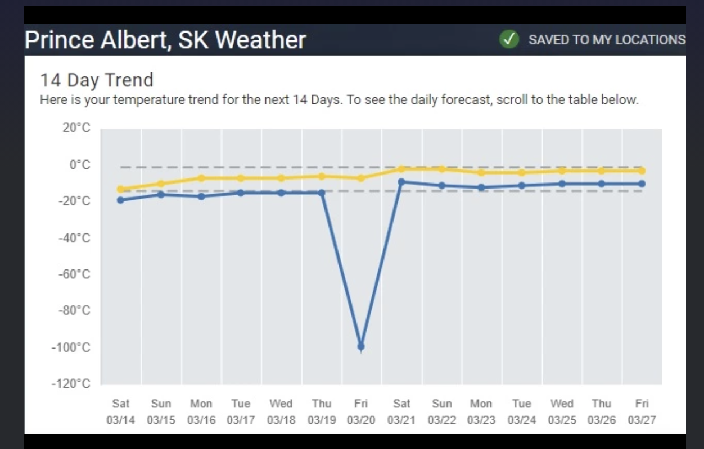
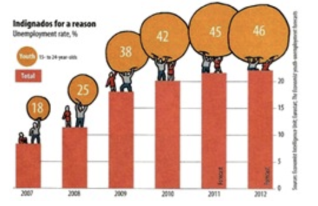
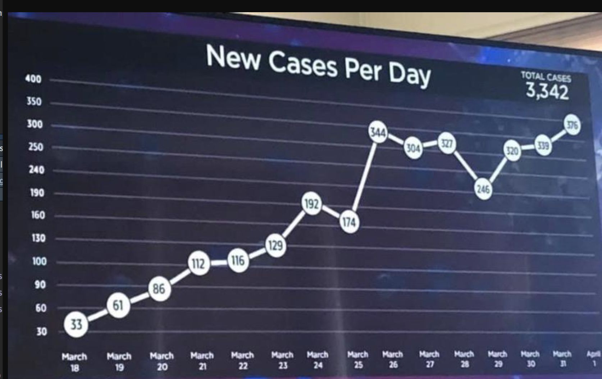
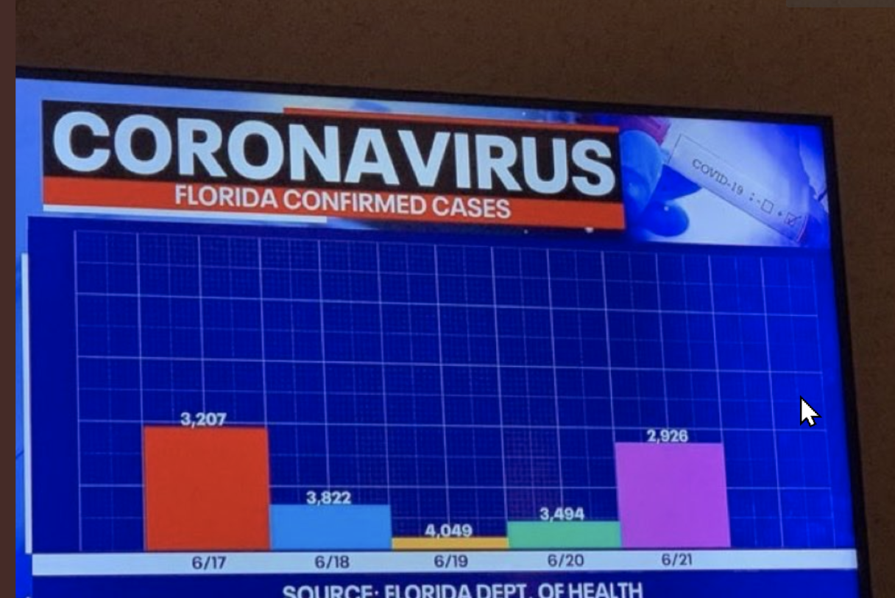
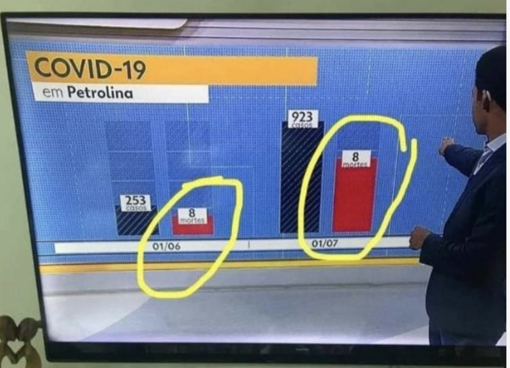

```{r setup, include=FALSE}
knitr::opts_chunk$set(echo = FALSE)
```


## Enkele handelingen vooraf    

Eerst maar eens de pakketten laden die gebruikt worden:   

```{r libraries}
library(tidyverse)
library(ggExtra)
library(ragg)
library(ggalluvial)
library(treemapify)
library(ggalt)

library(palmerpenguins)
```


Vervolgens de kleuren instellen.

## De dataset

```{r}
head(penguins)
#head(penguins_raw)
```


```{r}


# The VJI palette with grey
cbp3 <- c("#999999", "#C49047", "#508A9b", "#423C3D",
          "#C85825", "#006046", "#772D2E", "#999999" )

library(plotrix)
sliceValues <- rep(10, 8) # each slice value=10 for proportionate slices
(
  p <- pie3D(sliceValues, 
      explode=0, 
      theta = 1.2, 
      col = cbp3, 
      labels = cbp3, 
      labelcex = 0.9,
      shade = 0.6,
      main = "Colorblind\nfriendly palette")
)
```

```{r eval=FALSE, echo=FALSE}
pngfile <- fs::path("Figs",  "colors.png")
agg_png(pngfile, width = 40, height = 40, units = "cm", res = 100, scaling = 4)
pie3D(sliceValues, 
      explode=0, 
      theta = 1.2, 
      col = cbp3, 
      labels = cbp3, 
      labelcex = 0.9,
      shade = 0.6,
      main = "Colorblind\nfriendly palette")
invisible(dev.off())
knitr::include_graphics(pngfile)
```

```{r}
ggplot <- function(...) ggplot2::ggplot(...) + 
  scale_color_manual(values = cbp3) +
  scale_fill_manual(values = cbp3) +
  theme_bw()
```


```{r eval=FALSE, echo=FALSE}
p <- penguins %>%
  ggplot(aes(x = bill_length_mm, y = flipper_length_mm,
              color = species)) +
    geom_point()

pngfile <- fs::path(knitr::fig_path(),  "scaling.png")
agg_png(pngfile, width = 60, height = 36, units = "cm", res = 300, scaling = 3)
plot(p)
invisible(dev.off())
knitr::include_graphics(pngfile)
```


### 0. Datavisualisatie, cruciaal voor begrip en communicatie


Datavisualisatie is een cruciaal onderdeel van elke analyse. Of het nu "voor jezelf" is om verbanden en resultaten beter te begrijpen of om resultaten te presenteren en te "verkopen" aan anderen. Omdat goede grafieken de gegevens intuïtief toegankelijk maken, vertellen ze een verhaal en laten ze duidelijk patronen, trends of uitschieters zien. Daarom is Explorative Data Analyse (EDA) meestal de eerste stap van elke gegevensanalyse en -modellering. Alleen als we onze gegevens begrijpen, kunnen we de juiste voorbewerkingsstappen en analysemethoden, statistieken of 'deep learning'technieken toepassen. En aangezien mensen veel beter zijn in het visueel begrijpen van getallen in een grafiek dan in tabellen, moeten we de kracht van datavisualisatie gebruiken! Vooral bij het maken van visualisaties voor rapporten of publicaties is het cruciaal dat deze zowel feitelijk correct als visueel aantrekkelijk zijn.   

> Datavisualisatie is deels kunst en deels wetenschap. De uitdaging is om de kunst goed te krijgen zonder dat de wetenschap het bij het verkeerde eind heeft en vice versa. (Wilke 2019)

Het doel van een goede illustratie is dat het in één oogopslag begrijpelijk is en een duidelijke uitspraak doet. Slechte grafieken variëren van eenvoudigweg lelijk tot (opzettelijk?) misleidend of zelfs verkeerd. In dit artikel leg ik uit wat goede grafieken zijn (en wat niet) en hoe we ze kunnen maken met behulp van de Grammatica van Grafieken. En ik introduceer enkele van de meest gebruikte soorten grafieken, samen met negatieve voorbeelden "uit de vrije natuur".


## Wat maakt een goede grafiek?
### 1. Data
Het belangrijkste aspect en de basis van elke grafiek zijn de gebruikte gegevens! Ze moeten correct zijn en we moeten altijd controleren op mogelijke (meet)fouten. Zoals bijvoorbeeld in deze afbeelding:



Het is duidelijk dat er een fout in de voorspelling zit, want temperaturen van -100°C, zelfs op een hele speciale dag, zijn echt heel onwaarschijnlijk! En niet alleen toont deze grafiek duidelijk verkeerde gegevens; deze uitschietwaarde comprimeert de rest van de gegevens in de grafiek zodanig dat de curven niet meer duidelijk zichtbaar zijn en de waarden van verschillende dagen moeilijk te vergelijken zijn.

Tot goede praktijk van datavisualisatie behoort tevens het specificeren van de gegevensbron.


### 2. Overzichtelijkheid & kleuren
Een goede grafiek is juist zo complex omdat ze haar boodschap in één oogopslag moet overbrengen; ze moet duidelijk zijn en geen *"chart junk "* bevatten. Edward Tufte beschouwde alle visuele elementen in een grafiek die ofwel niet nodig zijn om de grafiek te begrijpen, ofwel zelfs afleiden van de centrale informatie  als grafiektroep (Tufte 1983). Drie voorbeelden daarvan zijn in deze figuur te zien:




Iedereen die regelmatig kranten leest zal merken dat "chart junk" extreem vaak voorkomt en vooral populair is bij populaire media om een chart te kruiden. In veel gevallen kan een onschuldige chartjunk worden afgedaan als "artistieke vrijheid", maar hoe ernstiger jouw grafiek wilt maken, hoe meer je die moet vermijden.

Duidelijkheid omvat ook de keuze van geschikte kleuren en duidelijke contrasten. Te veel, felle of grillige kleuren maken een plot visueel weerzinwekkend en zorgen ervoor dat het er overbeladen en verwarrend uitziet. Daarnaast moet je er bij de keuze van de kleuren ook op letten dat het voor kleurenblinden mogelijk is om de grafiek te lezen. Dit moet worden gedaan met behulp van een geschikt kleurenpalet, evenals redundante functies zoals verschillende vormen, patronen of lijntypes die het mogelijk maken om de grafiek te lezen, zelfs zonder kleurinformatie.

## Kleuren

### 3. etikettering & assen
Een goede grafiek is in één oogopslag te begrijpen, wat betekent dat ze voor zichzelf spreken. Essentieel hiervoor is de juiste etikettering met titel, aslabels (met eenheden!), legenda's en bijschriften! Ook het aantal assentikken moet op de juiste manier worden gekozen. En vooral: de afstanden tussen de assen moeten voor de numerieke waarden regelmatig zijn, d.w.z. dat de afstand tussen de teken in geen geval mag variëren, zoals te zien is op de y-as in deze vreselijke illustratie:




## De grammatica van de grafiek

We kennen nu de belangrijkste aspecten van goede grafieken. Maar wat is de beste manier om goede grafieken te maken?
Er zijn vele manieren om grafieken te genereren: met de hand tekenen, met Excel of met verschillende programmeertalen zoals R, Python, Java, enz. De beste manier, hoewel met een hogere instapdrempel, is het gebruik van programmeertalen. Dit is de eenvoudigste manier om ervoor te zorgen dat de gegevens schoon zijn en op een traceerbare manier kunnen worden verwerkt. Excel kan ook gebruikt worden om grafieken te maken, maar het programma heeft een paar valkuilen: Excel-format kan makkelijk leiden tot fouten in de gegevens. En het maakt het erg moeilijk om grafieken te reproduceren, omdat het niet documenteert welke stappen handmatig werden uitgevoerd en in welke volgorde.

R en Python zijn bijzonder geschikt omdat ze de meest gebruikte programmeertalen zijn voor het genereren van grafieken en omdat ze pakketten aanbieden die het analyseren van gegevens en het maken van grafieken zeer efficiënt maken. Hier presenteer ik de (naar mijn mening) beste manier om op een gestructureerde manier grafieken te genereren: met de pakketten `ggplot2` voor R of `plotnine` voor Python (gebaseerd op `ggplot2`).

Met `ggplot2` heeft Hadley Wickham een implementatie gemaakt van de 1999 Grammatica van Graphics voor de door Leland Wilkinson beschreven R-programmeertaal, die ik hieronder introduceer met codevoorbeelden (Wilkinson et al. 1999; Wickham 2010). Deze Grammatica van Graphics beschrijft een raamwerk voor het gestructureerd maken van grafieken die bestaan uit lagen die op elkaar voortbouwen (Wickham en Grolemund 2017). Hieronder laat ik een paar voorbeelden zien. Een overzicht van alle mogelijke opties is te vinden in het `ggplot2`-cheatsheet.


**1. Data**   

Ook voor de Grammatica van Graphics zijn data het belangrijkste en meest fundamentele element. Hier gebruik ik een voorbeelddataset met verschillende groottes van drie pinguïnsoorten (Gorman, 2014). De centrale functie van het `ggplot2`-pakket wordt `ggplot()` genoemd en neemt een dataset als invoer. Deze functie creëert eerst een leeg coördinatensysteem waarop we met de volgende lagen kunnen bouwen en zo onze grafiek stap voor stap kunnen creëren, aanpassen en uitbreiden.

**2. Esthetiek**   

Het tweede argument dat we definiëren in de `ggplot()` functie is de esthetiek `(aes())`. Esthetiek beschrijft grafische elementen zoals X- en Y-waarden, grootte, kleuren, vormen, enz. Voor een eenvoudige scatterplot moeten we ten minste de X- en Y-posities specificeren. Hiervoor moeten we eerst beslissen welke gegevens (variabelen) we in kaart willen brengen. Bijvoorbeeld hier de snavellengte van de pinguïn op de X-as tegen de vinlengte op de Y-as:

```{r}
penguins %>%
   ggplot(aes(x = bill_length_mm, 
              y = flipper_length_mm))
```
Zelfs met een bepaalde esthetiek krijgen we nog steeds geen echte grafiek te zien, maar we hebben de volgende laag nodig, de zogenaamde geometrie. Omdat esthetiek en geometrie zeer nauw met elkaar verbonden zijn en deels van elkaar afhankelijk zijn, laat ik hieronder extra esthetiek zien.

**3. Geometriek**   

Geometrische objecten of geometrieën beschrijven hoe de gegevens die we in de esthetiek hebben gedefinieerd, moeten worden weergegeven. Dit kan bijvoorbeeld een puntgrafiek `(geom_point())` of een lijngrafiek `(geom_line())` zijn, die nu ook als grafiek in deze laag wordt weergegeven:


```{r}
penguins %>%
   ggplot(aes(x = bill_length_mm, 
              y = flipper_length_mm)) +
     geom_point(alpha = 0.7)

penguins %>%
   ggplot(aes(x = bill_length_mm, 
              y = flipper_length_mm)) +
     geom_line()
```

Een lijngrafiek is echter niet nuttig voor de gegevens hier; meer hierover in de sectie Grafiektypen - Lijngrafieken. Andere geometrieën zijn staafdiagrammen `(geom_bar())` of boxplots `(geom_boxplot())`. Geometrie en esthetiek zijn onderling afhankelijk in die zin dat het gegevenstype van de esthetische variabelen alleen bepaalde geometrieën toelaat of zinvol is. Zo zijn strooi- en lijndiagrammen geschikt voor doorlopende X- en Y-assen (rationele getallen, tijden of datum). Voor staafdiagrammen moeten de X-as gegevens categorisch zijn. Voordat ik in de loop van latere lagen meer in detail zal ingaan op geometrieën en esthetiek, zal ik eerst facetten introduceren.


**4. Facetten**   

Facetten betekent het splitsen van een grafiek in verschillende subplots. In onze voorbeelddataset worden de meetwaarden van drie verschillende pinguïnsoorten verzameld. Het bovenstaande strooiplot laat echter niet toe om een onderscheid te maken tussen de drie soorten, wat natuurlijk een belangrijke bijkomende informatie is in de gegevens. Daarom moeten we dit in onze grafiek weergeven. Een manier om dit te doen is door gebruik te maken van facetten:


```{r}
penguins %>%
   ggplot(aes(x = bill_length_mm, 
              y = flipper_length_mm)) +
     geom_point(alpha = 0.7) +
     facet_wrap(vars(species), ncol = 3)
```

Nu zien we de punten voor elke soort pinguïn in een aparte subplot. Facetten kunnen worden gecreëerd voor één of meer categorische variabelen, maar meer dan twee facetten zullen in het algemeen verwarrend zijn. Standaard gebruikt `ggplot2` dezelfde X- en Y-asafmetingen om de subplots vergelijkbaar te maken. Met facetten is het in dit geval echter niet zo eenvoudig om de drie typen te vergelijken. Als alternatief kunnen we de drie pinguïnsoorten zichtbaar maken met behulp van verschillende kleuren. Deze mogelijkheid valt onder schaalvergroting.


**5. Schaalvergroting**   

Met schaalvergroting kunnen we naast de twee X- en Y-dimensies nog extra dimensies tonen, vergelijkbaar met wat we al gedaan hebben voor de pinguïnsoorten met facetten. Zo kunnen we bijvoorbeeld een kleurenschaal kiezen. In `ggplot2` worden schalen gegeven door extra variabelen in de esthetiek:


```{r}
penguins %>%
   ggplot(aes(x = bill_length_mm, 
              y = flipper_length_mm,
              color = species)) +
     geom_point(alpha = 0.7)
```

De bijbehorende legende wordt automatisch aangemaakt. Andere schalen zijn maatschalen, punt- of lijntypes. Niet alle schalen zijn geschikt voor elk datatype. Terwijl kleuren ook continue getallen kunnen vertegenwoordigen, zijn punt- en lijntypes slechts voor een beperkt aantal categorieën beschikbaar.


```{r}
penguins %>%
   ggplot(aes(x = bill_length_mm, 
              y = flipper_length_mm,
              color = sex,
              size = body_mass_g)) +
     geom_point(alpha = 0.7) +
     facet_wrap(vars(species), ncol = 3)
```

In principe kan elk aantal dimensies van de gegevens in een grafiek worden weergegeven, ook al kunnen meer dan vier dimensies de grafiek meestal te chaotisch en verwarrend maken.

Een ander type schaling is de asschaalverdeling. Zo kunnen we bijvoorbeeld de assen omdraaien zodat de waarden niet van links/naar beneden = laag naar rechts/boven = hoog worden weergegeven, maar de hoge waarden wel links/naar beneden worden weergegeven:


```{r}
penguins %>%
   ggplot(aes(x = bill_length_mm, 
              y = flipper_length_mm)) +
     geom_jitter(alpha = 0.5) +
     facet_wrap(vars(species), ncol = 3) +
     scale_x_reverse() +
     scale_y_reverse()
```


**6. Statistische Transformaties**   

Stats, afkorting voor statistische transformaties, worden gebruikt om statistische waarden of berekeningen toe te voegen aan een plot of om deze te definiëren. Dit kunnen bijvoorbeeld gemiddelde waarden zijn, mediaan, betrouwbaarheidsintervallen, standaardafwijkingen, enz.

In deze figuur is een staafdiagram weergegeven met een numerieke waarde:


```{r}
(
  p <- penguins %>%
    remove_missing() %>%
    group_by(species, sex) %>%
    summarise(mean_bmg = mean(body_mass_g),
              sd_bmg = sd(body_mass_g)) %>%
    ggplot(aes(x = species, y = mean_bmg,
               fill = sex)) +
    geom_bar(stat = "identity", position = "dodge") +
    geom_errorbar(aes(ymin = mean_bmg - sd_bmg, 
                      ymax = mean_bmg + sd_bmg), 
                  width = 0.2,
                 position = position_dodge(0.9)) +
      labs(x = "Soorten", 
           y = "Gemiddelde lichaamsgewicht (in g)",
          title = "Barchart", 
          subtitle = "Gemiddelde lichaamsgewicht van mannetjes-&vrouwtjespinguins per soorten\nmet standaard deviatie",
          caption = "Bron: https://github.com/allisonhorst/palmerpenguins")
)
```

Omdat de standaardstatistiek voor staafdiagrammen in `ggplot2` „Aantal (count)“ ist, kunnen deze verhoudingen mit de stat „identity“ worden veranderd.

Een van de meest gebruikte statistieken zijn 'Smoothed Conditional Means', om bijvoorbeeld de samenhang van de X- en Y-Variabelen met gladde lijnen en bijbehorende foutmarges aan te tonen:


```{r}
penguins %>%
   ggplot(aes(x = bill_length_mm, 
              y = flipper_length_mm)) +
     geom_point(alpha = 0.7) +
     facet_wrap(vars(species), ncol = 3) +
     stat_smooth(method = 'loess')
```

**7. Coördinatensystemen**   

De laatste laag in de Grammatica van Graphics zijn coördinatensystemen. Coördinatensystemen bepalen hoe de assen van onze grafiek moeten worden gerangschikt. Meestal is de X-as horizontaal en de Y-as verticaal (cartesiaans coördinatenstelsel); maar er zijn ook gevallen waarin we radiale of gebogen assen hebben, bijvoorbeeld in een taartdiagram of kaartweergave. Een taartdiagram is dus niets meer dan een staafdiagram waarin we het coördinatensysteem hebben veranderd:


```{r}
(
  p <- penguins %>%
    remove_missing() %>%
    group_by(species, sex) %>%
    summarise(n = n()) %>%
    mutate(freq = n / sum(n),
           percentage = freq * 100) %>%
    ggplot(aes(x = "", y = percentage,
               fill = sex)) +
    facet_wrap(vars(species), nrow = 1) +
    geom_bar(stat = "identity", alpha = 0.8) +
    coord_polar("y", start = 0) +
      labs(x = "", 
           y = "Percentage",
          title = "Taartdiagram", 
          subtitle = "Percentage of mannetjes- v. vrouwtjespenguins per soorten in de studie",
          caption = "Bron: https://github.com/allisonhorst/palmerpenguins")
)
```

**Diagramtypen**
Met deze Grammatica van Graphics kunnen nu alle gangbare diagramtypen eenvoudig en flexibel worden gegenereerd en uitgebreid. De meest gebruikte diagramtypen zijn:

**Puntdiagrammen**


```{r}

```

Puntdiagrammen worden vaak gebruikt wanneer we numerieke X-waarden tegen numerieke Y-waarden willen weergeven en dus hun correlatie willen laten zien. Plots kunnen verschillende kleuren, vormen en maten hebben. Meestal zijn puntdiagrammen gemakkelijk te begrijpen, maar ze kunnen ook verwarrend worden als er te veel overlappende punten zijn.


**Lijndiagrammen**

```{r}

```

Lijndiagrammen zijn meestal vergelijkbaar met puntdiagramma, met dat verschil dat de (denkbeeldige) punten met elkaar verbonden zijn door lijnen. Deze verbonden lijnen vertegenwoordigen de denkbeeldige tussenliggende waarden tussen twee meetpunten; punten moeten dus alleen verbonden worden als deze veronderstelling wordt gemaakt! Om deze reden is een lijngrafiek niet bruikbaar voor het bovenstaande voorbeeld, omdat we onafhankelijke metingen van individuele personen laten zien. Lijndiagrammen zijn vooral nuttig voor tijdreeksen.

 
**Staafdiagrammen**

```{r}

```

Staafdiagrammen tonen ofwel het aantal gebeurtenissen of ze tonen een numerieke waarde Y ter vergelijking tussen verschillende categorieën. Vooral bij staafdiagrammen vinden we veel negatieve voorbeelden met misleidende voorstellingen (waarschijnlijk omdat ze zo gemakkelijk te maken zijn met de eenvoudigste tekenprogramma's zonder enige gegevensbasis). Hier zijn twee zeer opvallende negatieve voorbeelden van de coronavirus situatie: in beide voorbeelden komen de staafhoogtes niet overeen met de waarden op de (niet getoonde) Y-as!






Een verzameling van andere veelgebruikte diagramtypen met illustraties en negatieve voorbeelden is te vinden in de dia's bij deze lezing.

**Referenties**   

Gorman, Tony D. AND Fraser, Kristen B. AND Williams. 2014. “Ecological Sexual Dimorphism and Environmental Variability Within a Community of Antarctic Penguins (Genus Pygoscelis).” *PLOS ONE 9 (3)*: 1–14. https://doi.org/10.1371/journal.pone.0090081.

Tufte, Edward R. 1983. *The Visual Display of Quantitative Information*. Graphics Press.

Wickham, Hadley. 2010. “A Layered Grammar of Graphics.” *Journal of Computational and Graphical Statistics 19 (1):* 3–28. https://doi.org/10.1198/jcgs.2009.07098.
Wickham, Hadley, and Garrett Grolemund. 2017. R for Data Science: Import, Tidy, Transform, Visualize, and Model Data. 1st ed. O’Reilly Media, Inc. https://r4ds.had.co.nz/.

Wilke, C. O. 2019. *Fundamentals of Data Visualization: A Primer on Making Informative and Compelling Figures*. O’Reilly Media. https://books.google.de/books?id=L3ajtgEACAAJ.

Wilkinson, L., D. Wills, J. Chambers, R. Dubbs, W. Eddy, A. Norton, and W. Haerdie. 1999. *The Grammar of Graphics. Statistics and Computing*. Springer New York. https://books.google.de/books?id=5boZAQAAIAAJ.


